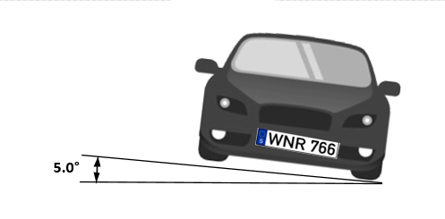
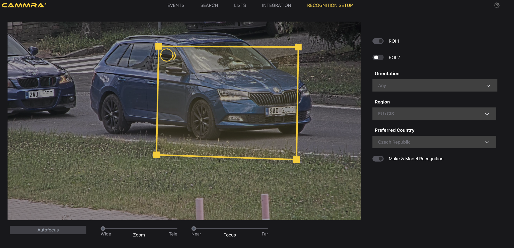
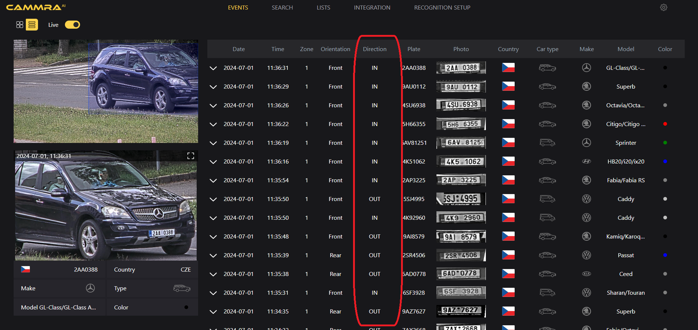
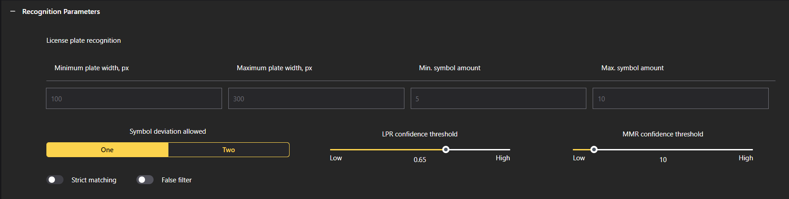
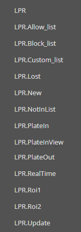
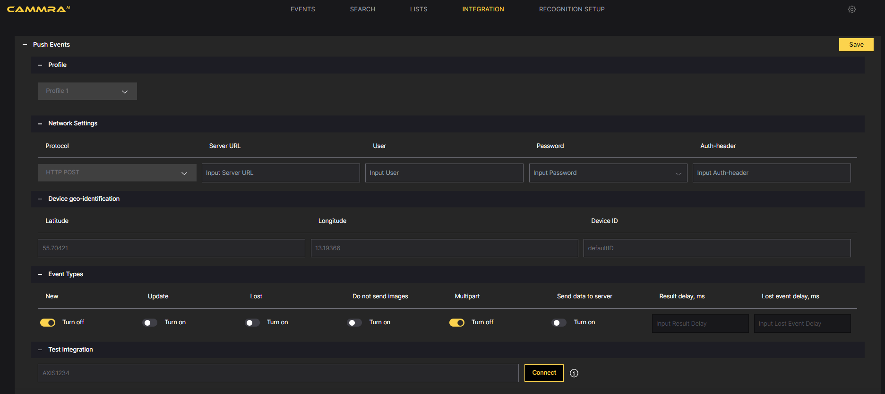
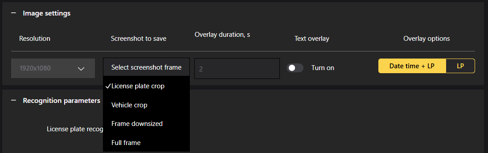
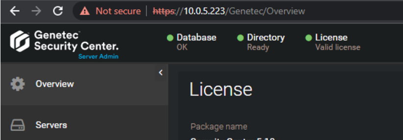
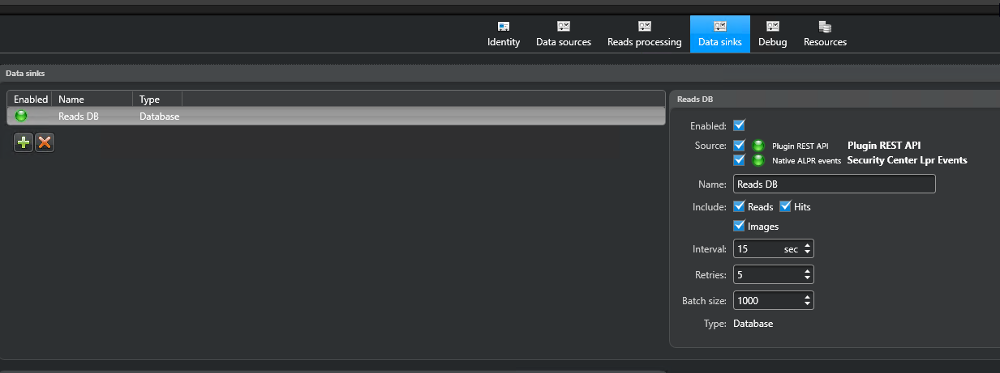
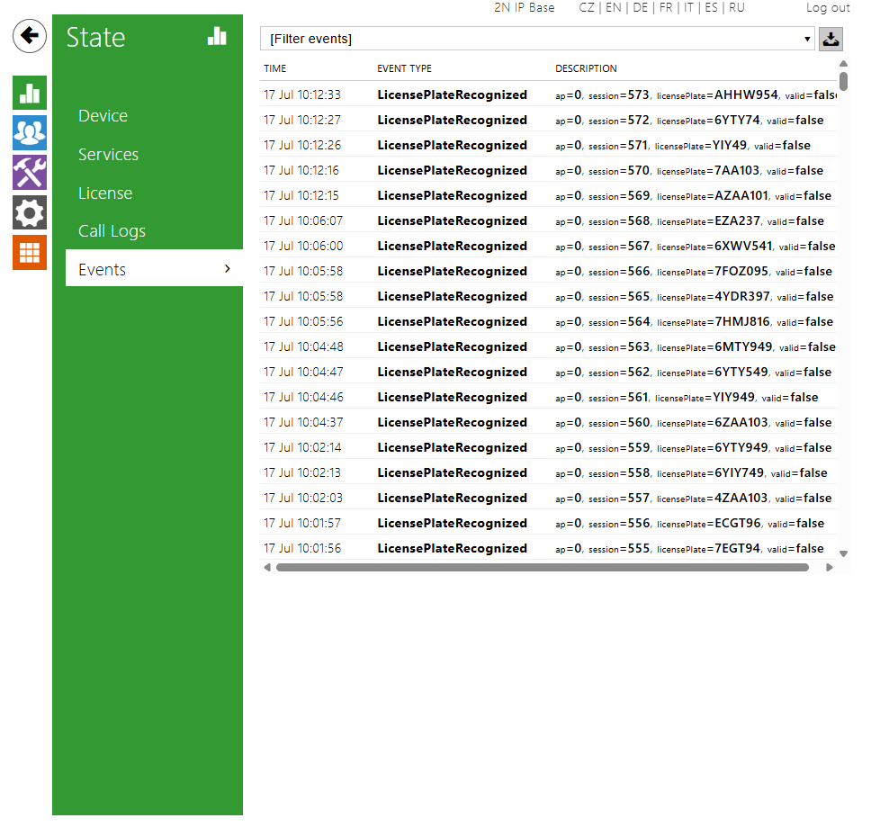

# **General information**

## Product description

CAMMRA AI is an AI-based data fusion application for vehicle data
recognition.

CAMMRA is an advanced application developed for Axis cameras with Artpec
8 processor only, leveraging the capabilities of the ACAP (Axis Camera
Application Platform) and DLPU (Deep learning processing unit), which
allows it to run several neural networks in parallel on board of these
cameras.

With CAMMRA AI, users can conveniently consolidate all essential traffic
data within a single application. By strategically installing the
cameras on roads leading to and from the city, user gets complete
control over traffic flows. The app is also ready for mobile
installation in vehicles. CAMMRA AI is a perfect sensor for tracking
stolen cars, providing data for law enforcement purposes and generating
statistical analyses.

By integrating CAMMRA AI with Axis cameras, they are transformed into
powerful traffic sensors capable of gathering vehicle information such
as make, model, color, type, and license plate - both from front and
rear view. This comprehensive data collection makes CAMMRA AI the
ultimate solution for monitoring city and highway traffic.

Moreover, compared to other ACAP solutions and previous generations of
the app (CAMMRA), speed measurement from radar (Axis) and sound
localization and measurement (Sorama) are possible to me added on top of
above mentioned parameters. With CAMMRA AI running on DLE video-fusion
cameras, the vehicle data are enriched by vehicle speed (in km/h or mph)
and if installed together with Sorama L642V units, vehicle loudness (in
dbA) is attached to every vehicle event.

CAMMRA AI is specifically designed to handle higher speeds and multiple
lanes, making it suitable for a wide range of traffic scenarios. The
application offers seamless integration through an open API, allowing
users to connect and integrate with other systems effortlessly. Primary
option for integration is FF DataFactory - data fusion platform from FF
Group, which is an unique place to centralize meta-data from even
hundreds of cameras equipped with CAMMRA AI, CAMMRA or Axis License
Plate Verifier apps. Moreover it provides valuable traffic insights and
receives other data to correlate with vehicle information.

Additionally, CAMMRA AI's meta-data has already been integrated with
regional law enforcement databases like Safercities (New Zealand)
SNIPR/Platform 1 (South Africa), Fusus, Auror and thanks to Macq M3 and
Jenoptik integrations meta-data from CAMMRA AI can be sent to national
databases in Belgium, UK and Australia. This ensures compatibility and
interoperability with existing infrastructure.

The solution is a fully server-less, all the analytics are done on edge
using camera processing power.

## Supported cameras

AXIS camera with ARTPEC-8 processor.

- [<u>AXIS Q1800-LE</u>](https://www.axis.com/products/axis-q1800-le)
  > Recommended for longer distance (Top choice)

- [<u>AXIS Q1805-LE</u>](https://www.axis.com/products/axis-q1805-le)
  > Recommended for longer distance (Second choice)

- [<u>AXIS P1465-LE 29
  > mm</u>](https://www.axis.com/products/axis-p1465-le) (recommended
  > for shorter distance)

- [<u>AXIS P3265-LVE 22
  > mm</u>](https://www.axis.com/products/axis-p3265-lve) (recommended
  > for shorter distance)

- [<u>AXIS Q1656-DLE Fusion
  > camera</u>](https://www.axis.com/products/axis-p3247-lve)
  > (recommended for shorter distance)

Other supported cameras

- P1465-LE 9mm

- P3265-LVE 9mm

- P3267-LVE

- P3268-LVE

- P1467-LE

- P1468-LE

- Q1806-LE

- Q1808-LE

- Q1686-DLE Radar-Video Fusion Camera

- P1518-LE

# **AXIS Camera setup**

## 

## Camera mounting recommendations

**Camera Mounting Angle:**

The camera's mounting angle should not exceed 45°, ideal is to keep
below 30°, but the recognition works well up to 45°. This ensures that
the camera captures the desired field of view without excessive tilting,
which can affect the accuracy of the captured data.


**Horizontal License Plate Alignment:**

It is crucial to align the license plate image horizontally within the
camera's field of view. The license plate should not be tilted more than
5° horizontally. If the image appears tilted beyond this threshold, it
is recommended to adjust the camera's position so that the license plate
appears horizontally in the live stream.



**Minimum License Plate size:**

<span class="mark">For rectangular (EU-style) license plates the minimum
required width is 100 pixels, optimal is 130px. For American license
plates types, min. 80 px is required, for plates with stacked symbols,
100px is recommended. Australian and New Zealand plates require also
100px for all plates. For license plates with two rows the optimal
required width is 80 pixels.</span>


**Optimal camera installation point:**


# **Power handling recommendations**

**Warning!**

While the application is running, the power source should not be
disconnected.

**N.B.:** The application continuously works with storage (camera
internal and SD card if available), it also may send events to external
servers.

Interrupting the power supply may result in unpredictable application
behavior.

## Storage (SD-card) recommendations

CAMMRA AI application can work either using internal device storage, or
using SD-card storage, if it is available.

**It is recommended to use SD-card in traffic solutions where data is
being sent to external systems. This will prevent data loss in case of
connectivity issues.**

In case internal device storage is used, CAMMRA AI application will be
able to store limited number of events depending on the stored image
settings:

- Full Frame - 3 images

- Vehicle crop - 10 images

- LP crop - 1000 images

CAMMRA AI application monitors SD-card status, so whenever SD-card
becomes available, application will restart and switch storage usage
from internal device to SD-card.

To store larger number of events (up to 100k), it is recommended to have
SD-card installed and mounted on camera device:

- Install SD-card (128 GB recommended for full-frame images storage)

- Go to the camera web page

- Go to System \> Storage

- Make sure SD card is turned on, mounted and formatted after first
  > setup

>  style="width:2.59722in;height:1.81944in" />

- Whenever SD card is installed, CAMMRA AI application needs to be
  > restarted

SD card shouldn’t be disabled while CAMMRA AI application is running

**Note: With any SD card capacity, CAMMRA AI stores up to 100K events.
After reaching 100K, it overwrites the older events.**

# 

# 

# 

# 

# 

# Event storage capacity

**Tested with CAMMRA AI 1.2, for 1.3 and further same values are
expected**

**Events stored on SD card**

License plate \| 100 MB \| 11650 events

Vehicle picture \| 100 MB \| 750 events

Full screen picture \| 100 MB \| 167 events

**Events stored with no SD card**

Full screen picture \| 580 MB (internal) \| 1000 events \| P1465-LE
camera

## Adjusting camera settings

Optimal Camera Settings for License Plate Recognition:

To ensure accurate license plate recognition, it is important to
configure the camera settings appropriately. Follow these steps to
optimize the camera settings for CAMMRA AI:

1.  Positioning the Vehicle: Adjust camera position, angle and zoom so
    > that vehicles are ideally completely within the region of interest
    > (ROI) to ensure that the license plate occupies a sufficient area
    > for detection and recognition.

2.  License Plate Size: Navigate to the camera's installation settings.
    > Enable the pixel counter and check that the width of a single-row
    > license plate is not less than about 100 pixels (130 px is
    > recommended), while a two-row license plate should be at least 80
    > px wide. Adjust the camera's position if needed to meet these size
    > requirements.

>  style="width:6.26772in;height:3.875in" />

3.  Image Adjustments: Access the camera's webpage and go to the Image
    > tab to make the following adjustments:

- Autofocus: Set the autofocus area to cover the license plate and click
  > Autofocus. Fine-tune the focus manually if necessary to ensure the
  > license plate appears sharp and clear.

- Wide Dynamic Range: Disable this setting to prevent overexposure in
  > high-contrast scenes. (with Q1800-LE you can leave the WDR on)

- Contrast: Set the contrast value to 65.

- Local Contrast: Set the local contrast to 65. This reduces noise
  > during nighttime while maintaining sufficient visibility of license
  > plates. Adjust this value if required, but be aware that it may
  > increase noise levels.

- Tone Mapping: Set the tone mapping value to 20.

- IR-Cut Filter: Set it to "Auto" to allow the camera to automatically
  > adjust the IR-cut filter based on lighting conditions.

- Max Shutter: Set the maximum shutter speed to 1/500 to optimize image
  > sharpness and clarity, for higher speeds 1/1000 is recommended

- Max Gain: Adjust the maximum gain to 21 dB to achieve an optimal
  > balance between reducing motion blur and controlling noise levels.
  > If license plates appear overexposed, decrease the max gain to 9 dB.
  > (when using WDR on Q1800-LE, you can set gain higher)

- Lock Aperture: Disable this setting to allow the camera's iris to
  > operate in automatic mode, especially if the vehicle is exposed to
  > direct sunlight.

4.  Testing and Evaluation: Test the camera settings by observing a
    > vehicle in the region of interest under various lighting
    > conditions. You may need to adjust the above settings according to
    > the conditions the camera is located in. For accurate results,
    > perform the tests in both low-light and daylight scenarios. This
    > ensures that the settings are well-adjusted for optimal
    > performance during different times of the day.

By following these steps and fine-tuning the camera settings, you can
optimize license plate visibility and enhance the accuracy of license
plate recognition within CAMMRA AI.

# 

# **Installing CAMMRA AI**

To access and manage applications on the camera's webpage, follow these
steps:

1.  Open the Camera's Webpage: Launch a web browser and enter the IP
    > address or hostname of the camera to access its webpage.

2.  Navigate to Application Settings: Within the camera's web interface,
    > locate the Main settings menu on the left, find and select the
    > Apps option. This will direct you to the application management
    > page.

>  style="width:3.22135in;height:1.69674in" />

3.  To install the app, you simple click on the “+ Add app” button,
    > upload the installation file (\*.eap) and then activate the
    > license with a code you got from your supplier. For license
    > activation, navigate to the right menu (three dots) and then
    > choose automatic activation (if camera has access to the Internet)
    > or offline activation with a key. For to generate the key, you
    > have to log in with your Axis account and create the key on an
    > [<u>Axis license key registration
    > portal</u>](https://www.axis.com/en-gb/support/license-key-registration#/registration).
    > Once installed, the menu looks following:

>  style="width:6.26772in;height:1.40278in" />

4.  Run the CAMMRA AI Application by sliding the switch
    > button. style="width:6.26772in;height:1.04167in" />

5.  Open the Application: Once CAMMRA AI is running, click on the Open
    > button. This will initiate the application and open it for
    > configuration and usage. First launch takes longer to initiate,
    > wait until the live image will appear, then the app is ready to
    > operate.

# **CAMMRA AI application setup**

## 

## Recognition Setup

### 

### **Region of interest**

1.  Access the Application's Web Page: Launch a web browser and enter
    > the URL or IP address of the CAMMRA AI application's web page.

2.  Navigate to the Recognition Setup Tab: On the CAMMRA AI web page.

3.  Define the Region of Interest (ROI): Usually 1 ROI is enough and
    > enables smoothest functioning, but you can set 2 ROIs. When
    > setting up the ROIs, it is recommended to keep them as much as
    > possible in the centre of the camera view. Ideally whole vehicle
    > fits into to the ROI. Avoid placing ROIs at the edges of the
    > image, as this may impact the accuracy of the detection. Adjust
    > each ROI to cover a specific area of interest within the camera's
    > field of view.

4.  Set the Car Movement Direction: To ensure correct tracking of car
    > movement, orient the arrow in the direction of the traffic flow.
    > The detected direction of the vehicles will be displayed in the
    > Direction column within the Events log.

>  style="width:5.40862in;height:2.60849in" />
>
>  style="width:5.43229in;height:2.56933in" />

By following these steps, you can access the CAMMRA AI application's web
page, navigate to the Recognition setup tab, define the region of
interest, set the car movement direction, and adjust the arrow to
indicate the preferred vehicle movement. These configurations enable
CAMMRA AI to effectively monitor and analyze traffic data based on the
specified settings.

### **Location setup**

On the RECOGNITION SETUP page, choose location settings according to the
camera location. Correct regional settings will help CAMMRA AI
application classify captured license plates.

1.  Region: Choose the supported regions based on your deployment
    > location. CAMMRA AI works in various regions of Europe (including
    > Turkey and Israel), CIS, EU+CIS, GCC (Middle-East), South Africa,
    > Australia, New Zealand, and both North and South America. In Asian
    > countries the app was adjusted to LPR only and make and model
    > recognition may achieve lower accuracy.

2.  Preferred Country: select country where the camera is located.

3.  Preferred State (for USA, Canada, Mexico): select state where the
    > camera is located.

Note: preferred country and state selection will not limit recognition
to the license plates of that country or state, but will help the
algorithm to classify captured plates more accurately. Other countries
from the regions are still recognized properly.

## 

## 

## 

## 

## Settings

### **Image settings**


To configure CAMMRA AI for optimal performance, follow these steps:

1.  Adjust Resolution:

> For now only Full HD (1080p) is supported, no need to adjust

2.  Set the Size of Saved Images: Configure the camera to save images at
    > the desired size to meet your specific requirements. Consider
    > factors such as storage capacity and image quality when
    > determining the appropriate size for the saved images.

3.  Enable Overlay Text: Toggle the overlay text feature to display
    > additional information on the captured images. This overlay can
    > include the day, month, year, time, license plate, and car brand
    > and model.

### 

### 

### **Recognition parameters**



To access the settings in CAMMRA AI and customize the application
according to your needs, follow these instructions:

1.  **Plate Width Min. and Max.**: The plate width size settings
    > determine the minimum and maximum width of license plates that
    > CAMMRA AI will recognize. It is recommended to use these values
    > unless specific adjustments are required: for Europe min width
    > 100px, for USA - 80px.

2.  **Number of Symbols**: Set the range for the minimum number of
    > symbols in license plates for the region or country templates. It
    > is advised to keep this range as narrow as possible to ensure
    > accurate recognition based on regional license plate patterns.

3.  **LPR Confidence Threshold**: Adjust the LPR confidence threshold to
    > determine the minimum confidence level required for a license
    > plate detection. A threshold of 0.65 to 0.7 is typically
    > recommended, striking a balance between detection rate and false
    > recognitions. Lower thresholds increase the detection rate but may
    > also result in more false recognitions.

4.  **MMR Confidence Threshold**: Set the confidence threshold for make
    > and model recognition. The optimal threshold depends on the task
    > CAMMRA AI needs to fulfill. For accurate make and model
    > recognition, a recommended range is 30-60. For type
    > classification, a range of 10 is suggested.

5.  **Comparison of Blacklisted Plates**: Choose the type of comparison
    > for blacklisted plates:

    - Strict Comparison: Only exact matches are considered for
      > blacklisted plates.

    - Soft Comparison(By default): Allows for differences in one or two
      > characters in the license plate while still considering it a
      > match.

### **Backup & Restore configuration**

To create a safe backup of all your CAMMRA AI application settings,
including license, use the “Backup configuration” feature. This will
create a file storing all the settings that you can save at preferred
location and then use it to restore in the application.

### **Settings for Stored Events**


To configure the storage settings for events in CAMMRA, follow these
steps:

1.  Select the Type of Events to be Stored: Choose the type of events
    > that should be stored based on your requirements:

    - All: All events, including both whitelisted and blacklisted, will
      > be stored.

    - Allow listed: Only events associated with whitelisted license
      > plates will be stored.

    - Block listed: Only events associated with blacklisted license
      > plates will be stored.

    - None: Events will not be stored but will be sent to third-party
      > systems such as A1001, cloud storage, or VMS (Video Management
      > Systems).

<!-- -->

2.  Determine the Storage Duration for Events: Specify the duration for
    > which events should be stored in the CAMMRA AI system. Select from
    > the following options:

    - No limit: Events will be stored indefinitely, allowing you to
      > retain a complete historical record (depends on storage size).

    - 1 day: Events will be stored for one day before being
      > automatically deleted.

    - 7 days: Events will be stored for seven days before being
      > automatically deleted.

    - 30 days: Events will be stored for 30 days before being
      > automatically deleted.

Choose the storage duration that aligns with your storage capacity and
the length of time you need to retain event data.

It's important to note that when a new event occurs, it will be assigned
a storing time based on the current settings. Changing the storage
settings will only affect new events and will not retroactively impact
previously stored events.

By configuring these settings, you can manage which events are stored in
CAMMRA AI and the duration for which they are retained. This allows you
to optimize storage capacity and align event storage with your specific
requirements.

**When the camera operates using an SD card, it’s essential to regularly
check the available storage, particularly if the card is shared with
other applications.**

**Insufficient or minimal remaining storage can lead to unexpected
application behavior.**

### **Security configuration**

Security/HTTPS Settings:  
To enhance the security of your CAMMRA AI application, you have the
option to enable HTTPS encryption and use self-signed certificates. By
turning on HTTPS encryption and utilizing self-signed certificates, you
can ensure that the communication between the application and browsers
is secure and protected. This helps safeguard the integrity and
confidentiality of data transmission.

# **Integration with other systems**

## VAPIX

Supported events



<table>
<colgroup>
<col style="width: 19%" />
<col style="width: 24%" />
<col style="width: 55%" />
</colgroup>
<thead>
<tr class="header">
<th><strong>Event</strong></th>
<th><strong>Description</strong></th>
<th><strong>Example</strong></th>
</tr>
<tr class="odd">
<th>LPR</th>
<th><p><strong>General</strong> event with <strong>metadata</strong></p>
<p><strong>Available always</strong></p>
<p>Event contains all data from LPR engine</p>
<p>Event can be sent several times per one license plate</p>
<p><em>NEW</em> - first license plate detection</p>
<p><em>UPDATE</em> - if something changes in LPR package</p>
<p><em>LOST</em> - when vehicle left the frame (+10 s after the last
detection)</p></th>
<th><p>&lt;tt:MetadataStream
xmlns:tt="http://www.onvif.org/ver10/schema"&gt;</p>
<p>&lt;tt:Event xmlns:tt="http://www.onvif.org/ver10/schema"&gt;</p>
<p>&lt;wsnt:NotificationMessage
xmlns:tns1="http://www.onvif.org/ver10/topics"
xmlns:tnsaxis="http://www.axis.com/2009/event/topics"
xmlns:wsnt="http://docs.oasis-open.org/wsn/b-2"
xmlns:wsa5="http://www.w3.org/2005/08/addressing"&gt;</p>
<p>&lt;wsnt:Topic
Dialect="http://docs.oasis-open.org/wsn/t-1/TopicExpression/Simple"&gt;tnsaxis:CameraApplicationPlatform/LPR&lt;/wsnt:Topic&gt;</p>
<p>&lt;wsnt:ProducerReference&gt;</p>
<p>&lt;wsa5:Address&gt;uri://c37d4bf5-fa69-498d-8294-e0c8ade51ded/ProducerReference&lt;/wsa5:Address&gt;</p>
<p>&lt;/wsnt:ProducerReference&gt;</p>
<p>&lt;wsnt:Message&gt;</p>
<p>&lt;tt:Message UtcTime="2021-05-17T13:40:12.509000Z"&gt;</p>
<p>&lt;tt:Source&gt;</p>
<p>&lt;/tt:Source&gt;</p>
<p>&lt;tt:Data&gt;</p>
<p>&lt;tt:SimpleItem Name="vehicleMake" Value="Ford" /&gt;</p>
<p>&lt;tt:SimpleItem Name="lpConfidence" Value="0.856800" /&gt;</p>
<p>&lt;tt:SimpleItem Name="lpImage" Value="" /&gt;</p>
<p>&lt;tt:SimpleItem Name="iso3166-2" Value="" /&gt;</p>
<p>&lt;tt:SimpleItem Name="vehicleType" Value="VAN" /&gt;</p>
<p>&lt;tt:SimpleItem Name="vehicleColor" Value="RED" /&gt;</p>
<p>&lt;tt:SimpleItem Name="vehicleConfidence" Value="1.000000" /&gt;</p>
<p>&lt;tt:SimpleItem Name="vehicleModel" Value="Tourneo Connect"
/&gt;</p>
<p>&lt;tt:SimpleItem Name="consumedTime" Value="104" /&gt;</p>
<p>&lt;tt:SimpleItem Name="frame_timestamp" Value="1039287603" /&gt;</p>
<p>&lt;tt:SimpleItem Name="carMoveDirection" Value="unknown" /&gt;</p>
<p>&lt;tt:SimpleItem Name="carState" Value="new" /&gt;</p>
<p>&lt;tt:SimpleItem Name="action" Value="No action" /&gt;</p>
<p>&lt;tt:SimpleItem Name="capture_timestamp" Value="1621258812509"
/&gt;</p>
<p>&lt;tt:SimpleItem Name="width" Value="192" /&gt;</p>
<p>&lt;tt:SimpleItem Name="carID" Value="1087595" /&gt;</p>
<p>&lt;tt:SimpleItem Name="top" Value="564" /&gt;</p>
<p>&lt;tt:SimpleItem Name="country" Value="CZE" /&gt;</p>
<p>&lt;tt:SimpleItem Name="region" Value="Středočeský kraj" /&gt;</p>
<p>&lt;tt:SimpleItem Name="left" Value="625" /&gt;</p>
<p>&lt;tt:SimpleItem Name="height" Value="32" /&gt;</p>
<p>&lt;tt:SimpleItem Name="listName" Value="" /&gt;</p>
<p>&lt;tt:SimpleItem Name="listMode" Value="none" /&gt;</p>
<p>&lt;tt:SimpleItem Name="listDescription" Value="" /&gt;</p>
<p>&lt;tt:SimpleItem Name="roiID" Value="1" /&gt;</p>
<p>&lt;tt:SimpleItem Name="text" Value="5SL5596" /&gt;</p>
<p>&lt;/tt:Data&gt;</p>
<p>&lt;/tt:Message&gt;</p>
<p>&lt;/wsnt:Message&gt;</p>
<p>&lt;/wsnt:NotificationMessage&gt;</p>
<p>&lt;/tt:Event&gt;</p>
<p>&lt;/tt:MetadataStream&gt;</p></th>
</tr>
<tr class="header">
<th><p>LPR.Allow_list</p>
<p>LPR.Block_list</p>
<p>LPR.Custom_list</p>
<p>LPR.NotInList</p></th>
<th><p><strong>Triggered</strong> events</p>
<p>Name of the events depend on the list name in the application</p>
<p><strong>Available only when any relay is connected</strong></p>
<p></p></th>
<th><p>&lt;tt:MetadataStream
xmlns:tt="http://www.onvif.org/ver10/schema"&gt;</p>
<p>&lt;tt:Event xmlns:tt="http://www.onvif.org/ver10/schema"&gt;</p>
<p>&lt;wsnt:NotificationMessage
xmlns:tns1="http://www.onvif.org/ver10/topics"
xmlns:tnsaxis="http://www.axis.com/2009/event/topics"
xmlns:wsnt="http://docs.oasis-open.org/wsn/b-2"
xmlns:wsa5="http://www.w3.org/2005/08/addressing"&gt;</p>
<p>&lt;wsnt:Topic
Dialect="http://docs.oasis-open.org/wsn/t-1/TopicExpression/Simple"&gt;tnsaxis:CameraApplicationPlatform/ALPV.NotInList&lt;/wsnt:Topic&gt;</p>
<p>&lt;wsnt:ProducerReference&gt;</p>
<p>&lt;wsa5:Address&gt;uri://c37d4bf5-fa69-498d-8294-e0c8ade51ded/ProducerReference&lt;/wsa5:Address&gt;</p>
<p>&lt;/wsnt:ProducerReference&gt;</p>
<p>&lt;wsnt:Message&gt;</p>
<p>&lt;tt:Message UtcTime="2021-05-17T15:42:54.961154Z"
PropertyOperation="Changed"&gt;</p>
<p>&lt;tt:Source&gt;</p>
<p>&lt;/tt:Source&gt;</p>
<p>&lt;tt:Key&gt;</p>
<p>&lt;/tt:Key&gt;</p>
<p>&lt;tt:Data&gt;</p>
<p>&lt;tt:SimpleItem Name="active" Value="0" /&gt;</p>
<p>&lt;/tt:Data&gt;</p>
<p>&lt;/tt:Message&gt;</p>
<p>&lt;/wsnt:Message&gt;</p>
<p>&lt;/wsnt:NotificationMessage&gt;</p>
<p>&lt;/tt:Event&gt;</p>
<p>&lt;/tt:MetadataStream&gt;</p></th>
</tr>
<tr class="odd">
<th><p>LPR.PlateIN</p>
<p>LPR.PlateOUT</p></th>
<th><p><strong>Triggered</strong> events</p>
<p><strong>Available only when any relay is connected</strong></p>
<p></p></th>
<th><p>&lt;tt:MetadataStream
xmlns:tt="http://www.onvif.org/ver10/schema"&gt;</p>
<p>&lt;tt:Event xmlns:tt="http://www.onvif.org/ver10/schema"&gt;</p>
<p>&lt;wsnt:NotificationMessage
xmlns:tns1="http://www.onvif.org/ver10/topics"
xmlns:tnsaxis="http://www.axis.com/2009/event/topics"
xmlns:wsnt="http://docs.oasis-open.org/wsn/b-2"
xmlns:wsa5="http://www.w3.org/2005/08/addressing"&gt;</p>
<p>&lt;wsnt:Topic
Dialect="http://docs.oasis-open.org/wsn/t-1/TopicExpression/Simple"&gt;tnsaxis:CameraApplicationPlatform/ALPV.PlateIn&lt;/wsnt:Topic&gt;</p>
<p>&lt;wsnt:ProducerReference&gt;</p>
<p>&lt;wsa5:Address&gt;uri://c37d4bf5-fa69-498d-8294-e0c8ade51ded/ProducerReference&lt;/wsa5:Address&gt;</p>
<p>&lt;/wsnt:ProducerReference&gt;</p>
<p>&lt;wsnt:Message&gt;</p>
<p>&lt;tt:Message UtcTime="2021-05-17T16:24:19.596468Z"
PropertyOperation="Changed"&gt;</p>
<p>&lt;tt:Source&gt;</p>
<p>&lt;/tt:Source&gt;</p>
<p>&lt;tt:Key&gt;</p>
<p>&lt;/tt:Key&gt;</p>
<p>&lt;tt:Data&gt;</p>
<p>&lt;tt:SimpleItem Name="active" Value="1" /&gt;</p>
<p>&lt;/tt:Data&gt;</p>
<p>&lt;/tt:Message&gt;</p>
<p>&lt;/wsnt:Message&gt;</p>
<p>&lt;/wsnt:NotificationMessage&gt;</p>
<p>&lt;/tt:Event&gt;</p>
<p>&lt;/tt:MetadataStream&gt;</p></th>
</tr>
<tr class="header">
<th>LPR.PlateInView</th>
<th></th>
<th></th>
</tr>
<tr class="odd">
<th><p>LPR.New</p>
<p>LPR.Update</p>
<p>LPR.Lost</p></th>
<th></th>
<th></th>
</tr>
<tr class="header">
<th>LPR.RealTime</th>
<th></th>
<th></th>
</tr>
<tr class="odd">
<th><p>LPR.Roi1</p>
<p>LPR.Roi2</p></th>
<th></th>
<th></th>
</tr>
</thead>
<tbody>
</tbody>
</table>

# 

# **FTP Fields Naming Conventions for CAMMRA AI Event Data**

## When CAMMRA AI sends events to an FTP server, it uses a specific pattern for naming the files, ensuring that each event's critical details are stored systematically.

## The naming convention encapsulates information like the timestamp, direction, car ID, license plate, country, and more.

## This structure is essential for organizing, parsing, and managing the data efficiently.

## 

## **File Naming Pattern**

## The naming convention follows this pattern:

## \#DEVICE_ID/%Y%m/%d/%Y%m%d%H%M%S\_%v\_#AOI\_#DIR\_#PLATE_ID\_#PLATE\_#COUNTRY

## 

## Example:

## 

## 20240913141423_613_roi_1_in_7543_47ATDPN_USA_Ford_Explorer_SUV_BLACK 

## 

<table>
<colgroup>
<col style="width: 20%" />
<col style="width: 53%" />
<col style="width: 25%" />
</colgroup>
<thead>
<tr class="header">
<th><h2 id="field"><strong>Field</strong></h2></th>
<th><h2 id="description"><strong>Description</strong></h2></th>
<th><h2 id="example-1"><strong>Example</strong></h2></th>
</tr>
<tr class="odd">
<th><h2 id="timestamp"><strong>Timestamp</strong></h2></th>
<th><h2 id="date-time-and-milliseconds-of-the-event">Date, time, and
milliseconds of the event</h2></th>
<th><h2 id="section-20">20240913141423_613</h2></th>
</tr>
<tr class="header">
<th><h2 id="roi-number"><strong>ROI Number</strong></h2></th>
<th><h2 id="region-of-interest-in-the-imagevideo">Region of interest in
the image/video</h2></th>
<th><h2 id="roi_1">roi_1</h2></th>
</tr>
<tr class="odd">
<th><h2 id="direction"><strong>Direction</strong></h2></th>
<th><h2 id="direction-of-vehicle-movement">Direction of vehicle
movement</h2></th>
<th><h2 id="in">in</h2></th>
</tr>
<tr class="header">
<th><h2 id="car-id"><strong>Car ID</strong></h2></th>
<th><h2 id="unique-vehicle-identifier">Unique vehicle
identifier</h2></th>
<th><h2 id="section-21">7543</h2></th>
</tr>
<tr class="odd">
<th><h2 id="license-plate"><strong>License Plate</strong></h2></th>
<th><h2 id="vehicles-license-plate-number">Vehicle’s license plate
number</h2></th>
<th><h2 id="atdpn">47ATDPN</h2></th>
</tr>
<tr class="header">
<th><h2 id="country"><strong>Country</strong></h2></th>
<th><h2 id="vehicles-registration-country">Vehicle’s registration
country</h2></th>
<th><h2 id="usa">USA</h2></th>
</tr>
<tr class="odd">
<th><h2 id="make"><strong>Make</strong></h2></th>
<th><h2 id="vehicle-manufacturer">Vehicle manufacturer</h2></th>
<th><h2 id="ford">Ford</h2></th>
</tr>
<tr class="header">
<th><h2 id="model"><strong>Model</strong></h2></th>
<th><h2 id="vehicle-model">Vehicle model</h2></th>
<th><h2 id="explorer">Explorer</h2></th>
</tr>
<tr class="odd">
<th><h2 id="color"><strong>Color</strong></h2></th>
<th><h2 id="vehicle-color">Vehicle color</h2></th>
<th><h2 id="black">BLACK</h2></th>
</tr>
</thead>
<tbody>
</tbody>
</table>

## **Type** Vehicle type SUV

## 

## Push Events configuration



To send the recognized data to other applications such as VMS (Video
Management Systems) or Data Management Systems, you can utilize
FF-Events in CAMMRA AI. Follow these steps to set up event sending:

1.  Go to the application's web page and select the "INTEGRATION" tab.

2.  Select **Profile** to configure: up to 3 profiles are supported.

3.  Select the **Protocol**: Choose the appropriate protocol for sending
    > events. The commonly used options are TCP (Transmission Control
    > Protocol) and HTTP POST (Hypertext Transfer Protocol with POST
    > method). You can also choose other protocols like FTP, UTMC, or
    > UTMC-2 based on your specific requirements.

> ***TCP*:** To send data to external applications, the TCP protocol is
> used. The camera establishes a TCP connection with the specified URL
> and sends data over the socket. The external application should open a
> TCP socket and listen for incoming data.
>
> ***HTTP POST*:** To send JSON data and images to a web service, the
> multipart POST HTTP(s) request method is used. The data transferred
> includes a JSON payload containing the event description and the
> associated image.
>
> Data Structure: Refer to the FF protocol documentation or the API FF
> Integration HTTP POST JSON for the data structure details. This
> documentation provides the necessary guidelines for formatting the
> data to be sent.

4.  Configure **Server URL**: Specify the link or URL where you want to
    > send the data. This could be the endpoint of the receiving
    > application or system. You can explicitly define URL starting with
    > HTTP (ex. `http://ip:port/listener.php`) in case camera Network
    > configuration allows both, HTTP and HTTPS, but your server is only
    > configured to use HTTP.

5.  Set **Device ID**: Assign a unique identifier to the packets sent
    > from the camera. This helps in distinguishing and tracking the
    > data packets.

6.  Define **Event Types**: Choose the desired event types based on your
    > requirements. The available event types include "New," "Update,"
    > and "Lost." Each event type corresponds to specific conditions and
    > triggers for sending data.

> ***New Event:*** This event occurs when a vehicle is detected for the
> first time. The direction of the vehicle is undefined.
>
> ***Update Event:*** This event occurs when there is a change in the
> data package. It can include updates to the recognized license plate,
> calculation and addition of direction, or changes in the recognition
> zone.
>
> ***Lost Event:*** This event occurs when a detected vehicle has been
> absent from the recognition zone for more than 10 seconds.

By configuring these FF-Events settings, you can establish the
communication and data exchange between CAMMRA AI and other applications
or systems. This enables you to seamlessly integrate the recognized data
into your preferred workflow and utilize it for further analysis or
processing.

## Sample json data

```json
{

"carID": "1327",

"roiID": "1",

"geotag": {"lat": 55.70421, "lon": 13.19366},

"carState": "update",

"datetime": "20240614 160436372",

"GEOtarget": "Camera",

"imageFile":
"localdata/images/36/20240614160426_32557roi_1AB1234_12977.jpg",

"imageType": "vehicle",

"imagesURI":
["/local/fflprapp/tools.cgi?action=getImage&name=9/20240614160436_464953lp_1AB1234_13046.jpg",
"/local/fflprapp/tools.cgi?action=getImage&name=36/20240614160426_32557roi_1AB1234_12977.jpg"],

"plateList": "",

"plateText": "1AB1234",

"plateUTF8": "1AB1234",

"profileID": "1",

"capture_ts":"1718373876372000000",

"imageFile2":
"localdata/images/9/20240614160436_464953lp_1AB1234_13046.jpg",

"plateASCII": "1AB1234",

"camera_info":

{

"MACAddress": "",

"SerialNumber": "B8A44F960ACE",

"ProdShortName": "AXIS Q1805-LE"

},

"plateRegion": "Praha",

"plateCountry": "CZE",

"plateUnicode": "1AB1234",

"vehicle_info":

{

"type": "CAR",

"view": "front",

"brand": "Skoda",

"color": "GRAY",

"model": "Rapid/Scala",

"confidenceMMR": "0.999847",

"confidenceColor": "0.989999"

},

"packetCounter": "13046",

"plateListMode": "",

"plateISO3166-2": "",

"plateImageSize": "0",

"plateImageType": "jpeg",

"timeProcessing": "0",

"frame_timestamp": "1718373875705442",

"plateConfidence": "0.868800",

"plateRegionCode": "A",

"carMoveDirection": "in",

"plateCoordinates": [519, 633, 141, 42],

"sensorProviderID": "PRG-82",

"capture_timestamp": "1718373876372",

"plateListDescription": "",

"plateCoordinatesRelative": [519, 633, 141, 42]

}
```

## Direct integration

Direct integration section is dedicated to integrations to 3rd party
systems, which requires sending in different format / protocol, than
CAMMRA AI provides on its own.

**CAMMRA AI configuration for Genetec Security Center integration:**

For to configure CAMMRA AI sending data to Genetec via 3rd party ALPR
plugin:

1\. Go to Direct integration and choose Genetec from the drop-down menu.


2\. Fill url ***https://\<hostname\>/api/v1/lpr/LprIngestion/reads***

Then choose any Camera ID name and user’s credentials.

In Genetec integration it’s not possible to choose the event type.
CAMMRA AI sends lost events only.

3\. Toggle Turn On button to the right to Enable integration.

4\. Use HTTPS and make sure to switch On Self-signed in the Settings \>
Security section.


5\. In Settings \> Image settings \> Screenshot to save \> Frame type
choose the type of image which will be displayed in Security Desk as a
part of read. Standard content of every read is text form of the License
plate, date and time information and License plate crop. It is
recommended to add Full frame or Downsized frame image to have a context
view.



**Configuration on Genetec side:**

First off all, check that entire system is online

1.  Go to ***https://\<your_ip_address\>/Genetec***

2.  Make sure that Database, Directory and License is online



If not, run all Genetec and SQLEXPRESS services


2\. Open Genetec™ Config Tool \>\>\> Plugins

3\. Press Add an entity \>\>\> Plugin and choose LPR plugin then next
next next

4\. Select added LPR plugin and go to Data sources tab and configure
field like this

Enabled: ✅

Name: Plugin REST API

API path prefix: lpr

REST port: 443

WebSDK host: localhost

WebSDK port: 443

Allow self signed certificates: ✅

Enabled: ✅

Name: Security Center Lpr Events

Processing frequency: 5 sec


5\. Go to Data sinks tab

6\. Click on plus sign  and choose Database type


> 7\. Configure database

Enabled: ✅

Source:

Plugin REST API ✅

Native ALPR events ✅

Name: Reads DB

Include:

Reads ✅

Hits ✅

Images ✅



8\. Go to Resources tab and
 Delete the database then
 Create a database

9\. Create an API user

a\. Go to Config Tool \>\>\> User Management and Add an entity User.
Enter User name and Password; Leave other fields without any changes.

b\. Select added user and go to Privileges tab allow the Third-party
ALPR reads API privilege and whole section of Application privileges
then 


**2N IP Base Intercom integration:**

To configure sending data to 2N via 3rd party ALPR plugin, go to Direct
integration and choose 2N IP device from the drop-down menu.

##  Step 1. Specify the URL IP address of your 2N device, use HTTPS and make sure to switch On Self-signed in the Settings \> Security section.

## 

## Step 2. Choose Barrier is used for Entry or Exit

Step 4 Enter user name and password of your 2N device

Step 5. Choose direction IN, OUT or ANY

Step 6. Enable and save the config.

If integration is properly configured, in 2N you should see something
like this:  
  


## Keepalive 

There is also a possibility to setup keepalive service to send keepalive
messages to server/cloud receiver. This service could also use
authentication (username, password, auth. header) as any other push
events. Users can customize the content of the keepalive message by
clicking on the button “Customize fields” and choosing appropriate
content in the subordinated menu. Also the frequency of sending is
configurable. To start sending these events, turn on the slider and
click on “Save”.


By pressing Customize fields, you can choose additional information
which can be included in the Keepalive message: Timestamp, Mac Address,
Device ID, App version or OS version.


# **Managing License Plate Lists**


CAMMRA AI offers the functionality to add license plates to both the
Block list and Allow list. You can conveniently add license plates
directly through the web interface or import them from a CSV file.
Here's how to manage the lists:

1.  Access the CAMMRA AI application's web page.

2.  Navigate to the appropriate section or tab for managing license
    > plate lists (LISTS).

3.  To add a license plate to the list, enter the license plate number
    > directly <span class="mark">or use a license plate pattern with
    > wildcards</span>.

    - For example, to add license plates starting with "SL" followed by
      > any three characters to block list, use the pattern "SL???". The
      > question mark represents any single character.

    - Similarly, use an asterisk (\*) to represent any number of
      > characters in a license plate. For instance, to add license
      > plates starting with "M" followed by any number of characters to
      > block list, use the pattern "M\*".

4.  Optionally, provide a description for each listed license plate for
    > reference purposes.

# **Barrier Control Scenario**

Enable automated gate access using CAMMRA AI plate recognition and
external hardware integration. Configure barrier logic for vehicle
access based on license plate lists.  
  
**Overview**

CAMMRA AI Barrier Control allows you to automate vehicle gate access by
integrating with external devices such as controllers, relays, or
internal I/O ports. License plates can be verified against Allow, Block,
or Custom lists to control access.  
In a barrier control scenario, CAMMRA AI uses license plate recognition
to detect vehicle plates and determine whether to trigger barrier access
based on pre-configured permissions. The AI verifies plates against
internal allow lists or block lists and communicates with a barrier
system using I/O or relay connections.

The barrier is automatically opened for authorized vehicles and can
remain closed for unauthorized ones. CAMMRA AI can be deployed at entry
or exit points for car parks, gated communities, or secured premises.

## **Barrier Control Type**

In the Settings \> Barrier control drop down menu \> Select the barrier
integration type:

- **Internal I/O**: Uses device’s onboard I/O ports.

- **Controller**: Connects to a third-party controller over IP (e.g.,
  > via HTTP/HTTPS).

- **Relay**: Triggers physical relays via I/O output.

**  
Control Methods Overview**

| **Method**   | **Hardware Needed**        | **Use Case**                                                                |
|--------------|----------------------------|-----------------------------------------------------------------------------|
| Internal I/O | Axis camera w/ I/O ports   | Select the camera’s internal output port connected to the physical barrier. |
| Controller   | External access controller | Integrate with door/gate access control systems                             |
| Relay Module | Networked relay device     | Flexible control via external relays                                        |

## **A. Barrier Control via Internal I/O**

In this scenario, CAMMRA AI is configured to automatically open a
barrier for specific vehicles based on license plate recognition and
logic defined in the Barrier Control settings. The barrier is triggered
using the camera's **internal I/O port**.

This mode is ideal when you want CAMMRA AI to act as a self-contained
access controller without requiring an external relay or controller
module.

### **Configuration Steps (Internal I/O)**

1.  **Go to** Barrier Control in CAMMRA AI settings.

2.  **Set Type**:  
    > Internal I/O (to use the built-in camera I/O ports for barrier
    > control).

3.  **Select I/O Output**:  
    > Choose the port physically connected to the gate or barrier
    > system.

4.  **(Optional) Select Virtual Port**:  
    > If using virtual triggers (e.g., software-based event logic),
    > assign a virtual port.

5.  **Set Barrier Mode**:

    - Do not open barrier: No access is granted, even if plates are
      > detected.

    - Open to all: Barrier opens for every detected vehicle.

    - Open from Lists: Opens only for license plates on selected lists.

      - You can select from:  
        > ▢ Allow List  
        > ▢ Block List  
        > ▢ Custom List

    - Open except Lists: Opens for all plates **except** those on
      > selected lists.

6.  **Vehicle Direction**:  
    > Define the direction of travel to trigger the barrier:

    - IN: Only incoming vehicles trigger the logic. trigger the logic.

    - OUT: Only outgoing vehicles trigger the logic.

    - ANY: Trigger for both directions.

7.  **Region of Interest (ROI)**:  
    > Choose the detection zone where license plates should be
    > recognized.  
    > Example: 1 for Entry Lane A, 2 for Exit Lane B.

### 

### **Example Use Case: Open Barrier for Authorized Entries Only**

If you want to **open the barrier only for vehicles in the Allow List**
and **only when entering**:

- Type: Internal I/O

- I/O Output: 5 (example)

- Virtual Port: None

- Barrier Mode: Open from Lists

  - ✓ Allow List

- Vehicle Direction: IN

- ROI: 1

Ensure that vehicles are properly added to the Allow List under **List
Management**.

### 

### **B. Controller (Third-Party Access Controller)**

Use when integrating CAMMRA AI with a third-party access controller over
the network.

#### **Use Case**

Ideal for setups where the gate or barrier is controlled via an external
access management system (e.g., Axis A1001, Bosch).

#### **Configuration Fields:**

- **Vehicle direction**: Defines camera direction — IN, OUT, or Any.

- **ROI**: Region of Interest; select which detection zone this
  > configuration applies to.

- **IP address**: IP of the access controller.

- **Username / Password**: Used for controller authentication.

- **Connect**: Verifies login and retrieves available controller and
  > reader.

- **Door controller name**: Select controller (fetched after connect).

- **Reader name**: The reader/door endpoint to trigger.

- **On/Off Integration**: Enables/disables integration runtime.

- **Test Integration**: Sends a test signal to ensure connectivity.

#### **Operation:**

- When a license plate matches a configured list (based on barrier
  > mode), a request is sent to the access controller to open the
  > door/barrier.

- The system does **not forward the license plate as a credential**.

- The controller must be pre-configured to treat the reader event as a
  > trigger (CAMMRA AI does not create or manage identities/credentials
  > in the controller).


### 

### **C. Relay Output (I/O Trigger)**

Use when cameraI directly controls a barrier using a hardware relay.
When the camera is connected to a relay box or onboard I/O ports.

#### **Use Case:**

For simple installations where a dry contact signal is sufficient to
trigger a gate/barrier (without access management software)

Requirements:

1\. Camera physically installed and connected to the network.

2\. CAMMRA AI is up and running on the Axis camera.

3\. Cables connected between the barrier and the relay module.

4\. Basic setup done (See section how to configure ROI and other
parameters).

#### **Configuration Fields:**

- **I/O Output \#**: Select hardware output (relay) to be activated.

- **Barrier mode**: Defines which lists allow access (check you Allow,
  > Block, Custom List).

- **Vehicle direction**: IN, OUT, or Any.

- **ROI**: Region of detection.

- **IP address**:  
  > Enter the IP address for the relay module in format 192.168.0.0  
  > Username for the relay module  
  > Password for the relay module

- **On/Off Integration**: Enables/disables relay triggering logic.


#### 

#### 

#### **Behavior:**

- When the detected plate matches configured logic (based on list and
  > mode), CAMMRA AI triggers the output for a fixed pulse duration
  > (usually 1–2 seconds).

- Relay behavior is binary: activate or not, based on plate match.

- No feedback from the relay (CAMMRA AI does not verify if the gate
  > physically opened).
