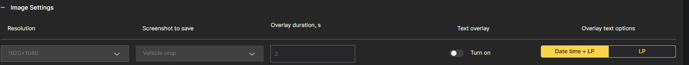
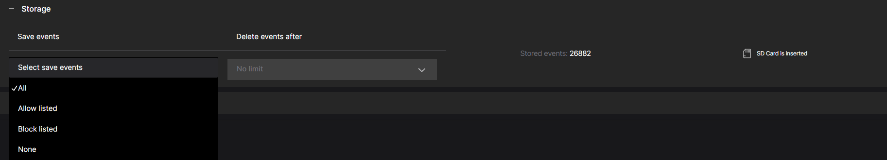

# Settings

## Image Settings

To configure CAMMRA AI for optimal performance:

1. **Resolution**: Only Full HD (1080p) is currently supported

2. **Size of Saved Images**: Configure the camera to save images at the desired size based on storage capacity and image quality requirements

3. **Overlay Text**: Toggle to display additional information on captured images:
   - Day, month, year, time
   - License plate
   - Car brand and model

## Recognition Parameters

| Parameter | Description | Recommended Value |
|-----------|-------------|-------------------|
| **Plate Width Min/Max** | Width range of license plates to recognize | EU: min 100px, USA: min 80px |
| **Number of Symbols** | Range for minimum symbols in license plates | Keep as narrow as possible for region |
| **LPR Confidence Threshold** | Minimum confidence for plate detection | 0.65 - 0.70 |
| **MMR Confidence Threshold** | Confidence for make/model recognition | 30-60 (accurate MMR), 10 (type classification) |

### Blacklisted Plates Comparison

- **Strict Comparison**: Only exact matches are considered
- **Soft Comparison** (default): Allows differences in 1-2 characters

## Backup & Restore Configuration

To create a safe backup of all your CAMMRA AI application settings (including license):
1. Use the **"Backup configuration"** feature
2. Save the created file at your preferred location
3. Use it later to restore settings in the application

## Settings for Stored Events

### Event Types to Store

| Option | Description |
|--------|-------------|
| **All** | All events (whitelisted and blacklisted) |
| **Allow listed** | Only whitelisted license plates |
| **Block listed** | Only blacklisted license plates |
| **None** | Events not stored locally, only sent to third-party systems |

### Storage Duration

| Option | Description |
|--------|-------------|
| **No limit** | Events stored indefinitely (depends on storage size) |
| **1 day** | Auto-deleted after 1 day |
| **7 days** | Auto-deleted after 7 days |
| **30 days** | Auto-deleted after 30 days |

:::note
New events are assigned storing time based on current settings. Changing storage settings only affects new events.
:::

:::warning
When operating with SD card, regularly check available storage, especially if shared with other applications. Insufficient storage can lead to unexpected application behavior.
:::

## Security Configuration

To enhance security of your CAMMRA AI application:
- Enable **HTTPS encryption**
- Use **self-signed certificates**

This ensures secure and protected communication between the application and browsers.
