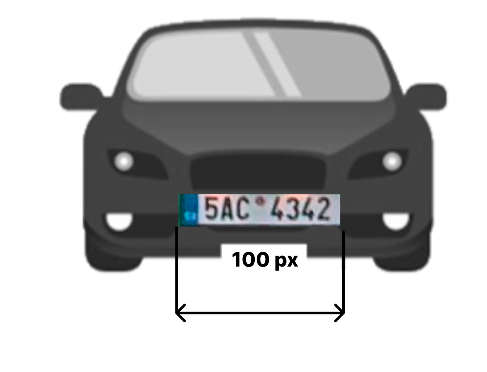

# Camera Mounting Recommendations

## Camera Mounting Angle

The camera's mounting angle should not exceed 45°. Ideal is to keep below 30°, but the recognition works well up to 45°. This ensures that the camera captures the desired field of view without excessive tilting, which can affect the accuracy of the captured data.

## Horizontal License Plate Alignment

It is crucial to align the license plate image horizontally within the camera's field of view. The license plate should not be tilted more than 5° horizontally. If the image appears tilted beyond this threshold, it is recommended to adjust the camera's position so that the license plate appears horizontally in the live stream.

## Minimum License Plate Size

| Plate Type | Minimum Width | Optimal Width |
|------------|---------------|---------------|
| EU-style rectangular | 100 px | 130 px |
| American plates | 80 px | 100 px |
| Stacked symbols | 100 px | - |
| Australian/NZ plates | 100 px | - |
| Two-row plates | 80 px | - |

## Optimal Camera Installation Point

