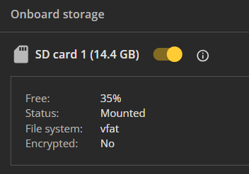

# Storage (SD-card) Recommendations

CAMMRA AI application can work either using internal device storage or SD-card storage if available.

:::warning Recommended
It is recommended to use SD-card in traffic solutions where data is being sent to external systems. This will prevent data loss in case of connectivity issues.
:::

## Internal Storage Capacity

When using internal device storage, CAMMRA AI can store a limited number of events depending on the stored image settings:

| Image Type | Max Events |
|------------|------------|
| Full Frame | ~3 images |
| Vehicle crop | ~10 images |
| LP crop | ~1000 images |

## SD Card Storage

To store larger number of events (up to 100k), install and configure an SD card:

1. Install SD-card (128 GB recommended for full-frame images storage)
2. Go to the camera web page
3. Navigate to **System > Storage**
4. Make sure SD card is turned on, mounted and formatted after first setup

:::caution
- Whenever SD card is installed, CAMMRA AI application needs to be restarted
- SD card shouldn't be disabled while CAMMRA AI application is running
:::

:::note
With any SD card capacity, CAMMRA AI stores up to 100K events. After reaching 100K, it overwrites the older events.
:::

## Event Storage Capacity

**Tested with CAMMRA AI 1.2, same values expected for 1.3+**

### Events stored on SD card (per 100 MB)

| Image Type | Events per 100 MB |
|------------|-------------------|
| License plate | ~11,650 events |
| Vehicle picture | ~750 events |
| Full screen picture | ~167 events |

### Events stored without SD card

| Image Type | Storage | Events | Camera |
|------------|---------|--------|--------|
| Full screen picture | 580 MB (internal) | ~1000 events | P1465-LE |

---

# Power Handling Recommendations

:::danger Warning
While the application is running, the power source should not be disconnected.
:::

The application continuously works with storage (camera internal and SD card if available), and may send events to external servers.

**Interrupting the power supply may result in unpredictable application behavior.**
