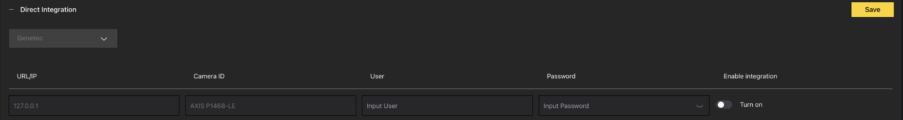
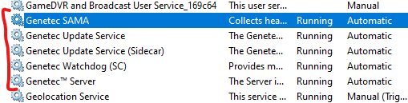
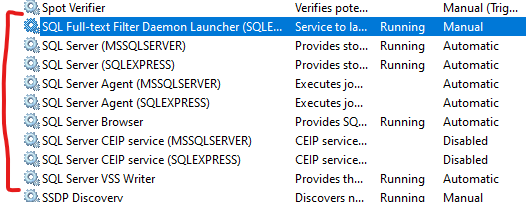
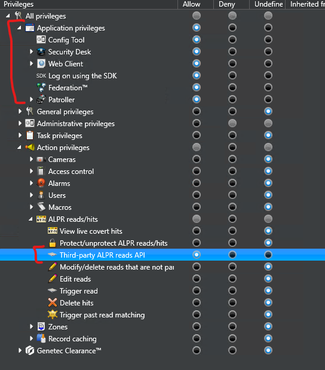

# Genetec Security Center Integration

## CAMMRA AI Configuration

To configure CAMMRA AI sending data to Genetec via 3rd party ALPR plugin:

### Step 1: Configure Direct Integration

1. Go to **Direct integration** and choose **Genetec** from the drop-down menu

2. Fill URL: `https://<hostname>/api/v1/lpr/LprIngestion/reads`
3. Choose any Camera ID name
4. Enter user credentials

:::note
In Genetec integration it's not possible to choose the event type. CAMMRA AI sends lost events only.
:::

### Step 2: Enable Integration

1. Toggle **Turn On** button to enable integration
2. Use HTTPS and make sure to switch On **Self-signed** in Settings > Security section

### Step 3: Configure Image Settings

In **Settings > Image settings > Screenshot to save > Frame type**, choose the type of image for Security Desk:

Standard content of every read:
- Text form of License plate
- Date and time information
- License plate crop

**Recommended**: Add Full frame or Downsized frame image for context view.

---

## Genetec Side Configuration

### Prerequisites

First, verify the entire system is online:

1. Go to `https://<your_ip_address>/Genetec`
2. Ensure Database, Directory and License are online

If not online, run all Genetec and SQLEXPRESS services:

### Step 1: Add LPR Plugin

1. Open **Genetec™ Config Tool > Plugins**
2. Press **Add an entity > Plugin**
3. Choose **LPR plugin**, then next, next, next

### Step 2: Configure Data Sources

1. Select the added LPR plugin
2. Go to **Data sources** tab
3. Configure fields:

| Field | Value |
|-------|-------|
| Enabled | ✅ |
| Name | Plugin REST API |
| API path prefix | lpr |
| REST port | 443 |
| WebSDK host | localhost |
| WebSDK port | 443 |
| Allow self signed certificates | ✅ |

4. Add second data source:

| Field | Value |
|-------|-------|
| Enabled | ✅ |
| Name | Security Center Lpr Events |
| Processing frequency | 5 sec |

### Step 3: Configure Data Sinks

1. Go to **Data sinks** tab
2. Click  and choose **Database** type

3. Configure database:

| Field | Value |
|-------|-------|
| Enabled | ✅ |
| Source | Plugin REST API ✅, Native ALPR events ✅ |
| Name | Reads DB |
| Include | Reads ✅, Hits ✅, Images ✅ |

### Step 4: Create Database

1. Go to **Resources** tab
2.  Delete the database
3.  Create a database

### Step 5: Create API User

1. Go to **Config Tool > User Management**
2. **Add an entity > User**
3. Enter Username and Password
4. Leave other fields without changes
5. Go to **Privileges** tab
6. Allow:
   - Third-party ALPR reads API privilege
   - Whole section of Application privileges
7.  Apply changes

