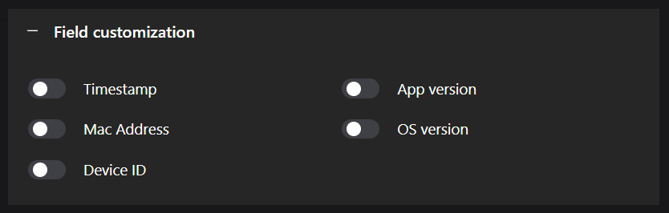

# Push Events Configuration


To send recognized data to other applications such as VMS or Data Management Systems, configure FF-Events in CAMMRA AI.

## Configuration Steps

1. Go to the application's web page and select the **"INTEGRATION"** tab
2. Select **Profile** to configure (up to 3 profiles supported)
3. Select the **Protocol**
4. Configure **Server URL**
5. Set **Device ID**
6. Define **Event Types**

## Supported Protocols

### TCP

The camera establishes a TCP connection with the specified URL and sends data over the socket. The external application should open a TCP socket and listen for incoming data.

### HTTP POST

Sends JSON data and images to a web service using multipart POST HTTP(s) request. The data includes:
- JSON payload with event description
- Associated image

Refer to the FF protocol documentation for data structure details.

### Other Protocols

- FTP
- UTMC
- UTMC-2

## Event Types

| Event | Description |
|-------|-------------|
| **New** | Vehicle detected for the first time (direction undefined) |
| **Update** | Change in data package (plate update, direction calculated, zone change) |
| **Lost** | Vehicle absent from recognition zone for more than 10 seconds |

## Server URL

Specify the endpoint URL where data should be sent. Example:

```
http://ip:port/listener.php
```

:::note
You can explicitly define URL starting with HTTP if camera Network configuration allows both HTTP and HTTPS, but your server only supports HTTP.
:::

## Device ID

Assign a unique identifier to packets sent from the camera. This helps distinguish and track data packets from multiple cameras.

---

# FTP Naming Conventions

When CAMMRA AI sends events to an FTP server, it uses a specific pattern for naming files.

## File Naming Pattern

```
#DEVICE_ID/%Y%m/%d/%Y%m%d%H%M%S_%v_#AOI_#DIR_#PLATE_ID_#PLATE_#COUNTRY
```

### Example

```
20240913141423_613_roi_1_in_7543_47ATDPN_USA_Ford_Explorer_SUV_BLACK
```

### Field Breakdown

| Field | Description | Example |
|-------|-------------|--------|
| Timestamp | Date, time, and milliseconds | 20240913141423_613 |
| ROI Number | Region of interest | roi_1 |
| Direction | Vehicle movement direction | in |
| Car ID | Unique vehicle identifier | 7543 |
| License Plate | Plate number | 47ATDPN |
| Country | Registration country | USA |
| Make | Vehicle manufacturer | Ford |
| Model | Vehicle model | Explorer |
| Type | Vehicle type | SUV |
| Color | Vehicle color | BLACK |

---

# Keepalive Service

Setup keepalive service to send periodic messages to server/cloud receiver.


## Configuration

- Authentication: username, password, auth header
- Frequency: configurable
- Custom fields via **"Customize fields"** button:
  - Timestamp
  - Mac Address
  - Device ID
  - App version
  - OS version



To start sending keepalive events, turn on the slider and click **"Save"**.
