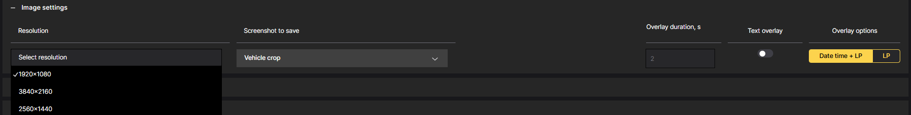

# Image Settings

To configure CAMMRA AI for optimal performance, follow these steps:

1. **Adjust Resolution:**
   - 1920x1080
   - 3840x2160
   - 2560x1440

   Recognition on 4K resolution widens installation scenarios and adds some versatility to CAMMRA AI usage. The 2-stage approach makes it available and effective.

   However, this does not mean 4 lanes with dense traffic are fully supported. This function is experimental (BETA), it works stable, but the performance in different scenarios must still be tested. Recommended usage is still 2 or max. 3 lanes with max. mid-speed.

2. **Set the Size of Saved Images:**
   Configure the camera to save images at the desired size to meet your specific requirements.
   Consider factors - storage capacity and image quality when determining the appropriate size for the saved images.

3. **Enable Overlay Text:**
   Toggle the overlay text feature to display additional information on the captured images.
   This overlay can include the day, month, year, time, license plate, and car brand and model.
