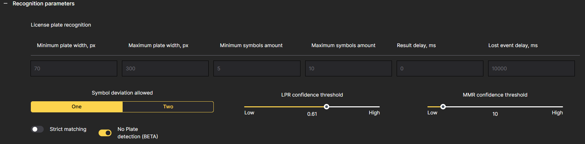

# Recognition Parameters

To access the settings in CAMMRA AI and customize the application according to your needs, follow these instructions:

1. **Plate Width Min. and Max:**  
   The plate width size settings determine the minimum and maximum width of license plates that CAMMRA AI will recognize.
   
   It is recommended to use default values unless specific adjustments are required.

2. **Number of Symbols:**  
   Set the range for the minimum number of symbols in license plates for the region or country templates.
   It is advised to keep this range as narrow as possible to ensure accurate recognition based on regional license plate patterns.

3. **Result delay and Lost event delay:**  
   Result delay sets how long after the first detection (new event) the waits and accumulates other detections for.

4. **LPR Confidence Threshold:**  
   Adjust the LPR confidence threshold to determine the minimum confidence level required for a license plate.
   A threshold of 0.4 is typically recommended, striking a balance between detection rate and false recognitions.
   Lower thresholds increase the detection rate but may also result in more false recognitions.

5. **MMR Confidence:**  
   Set the confidence threshold for make and model recognition.
   The optimal threshold depends on the task CAMMRA AI needs to fulfill.
   For type classification, a range of 10 is suggested.

6. **No Plate detection (BETA):**  
   Ability to detect vehicles without License plates.

7. **Comparison of Blacklisted Plates:**  
   Choose the type of comparison for blacklisted plates:
   - **Strict Comparison:** Only exact matches are considered for blacklisted plates.
   - **Soft Comparison (By default):** Allows for differences in one or two characters in the license plate while still considering it a match.
