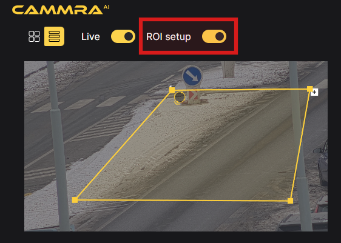
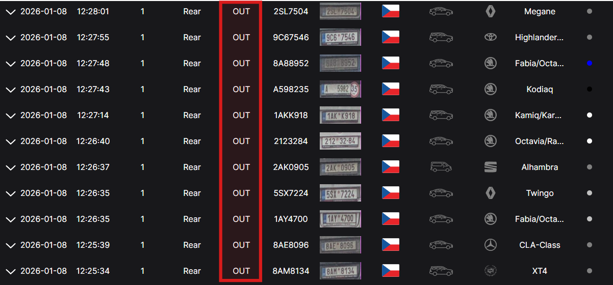

# Region of Interest Setup

## Recognition Setup

### Region of Interest

1. **Access the Application's Web Page:**  
   Launch a web browser and enter the URL or IP address of the CAMMRA AI application's web page.

2. **Navigate to the ROI Setup:**  
   On the CAMMRA AI web page.

3. **Define the Regions of Interest (ROI):**  
   - When setting up the ROIs, it is recommended to keep them as small as possible.
   - Avoid placing ROIs at the edges of the image, as this may impact the accuracy of the detection.
   - Adjust each ROI to cover a specific area of interest within the camera's field of view.

4. **Set the Car Movement Direction:**  
   - To ensure correct tracking of car movement, orient the arrow in the direction of the traffic flow.
   - The detected direction of the vehicles will be displayed in the Direction column within the Events log.

By following these steps, you can access the CAMMRA AI application's web page, navigate to the ROI setup, define the region of interest, set the car movement direction, and adjust the arrow to indicate the preferred vehicle movement.

These configurations enable CAMMRA AI to effectively monitor and analyze traffic data based on the specified settings.
