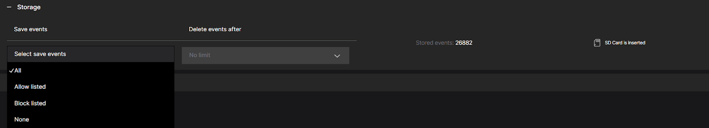

# Settings for Stored Events

To configure the storage settings for events in CAMMRA, follow these steps:

1. **Select the Type of Events to be Stored:**
   Choose the type of events that should be stored based on your requirements:
   - **All:** All events, including both whitelisted and blacklisted, will be stored.
   - **Allow listed:** Only events associated with whitelisted license plates will be stored.
   - **Block listed:** Only events associated with blacklisted license plates will be stored.
   - **None:** Events will not be stored but will be sent to third-party systems such as A1001, cloud storage, or VMS (Video Management Systems).

2. **Determine the Storage Duration for Events:**
   Specify the duration for which events should be stored in the CAMMRA AI system.
   Select from the following options:
   - **No limit:** Events will be stored indefinitely, allowing you to retain a complete historical record (depends on storage size).
   - **1 day:** Events will be stored for one day before being automatically deleted.
   - **7 days:** Events will be stored for seven days before being automatically deleted.
   - **30 days:** Events will be stored for 30 days before being automatically deleted.

Choose the storage duration that aligns with your storage capacity and the length of time you need to retain event data.

It's important to note that when a new event occurs, it will be assigned a storing time based on the current settings. Changing the storage settings will only affect new events and will not retroactively impact previously stored events.

By configuring these settings, you can manage which events are stored in CAMMRA AI and the duration for which they are retained. This allows you to optimize storage capacity and align event storage with your specific requirements.

:::warning
When the camera operates using an SD card, it's essential to regularly check the available memory, particularly if the card is shared with other applications. Insufficient or minimal remaining memory can lead to unexpected application behavior.
:::
