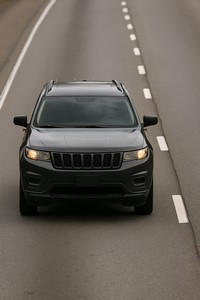
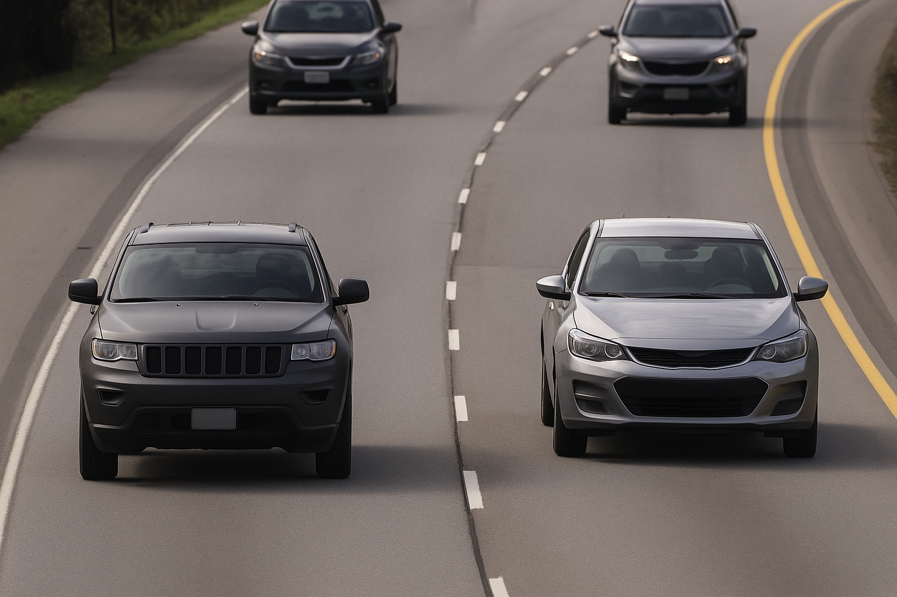

# Adjusting Camera Settings

## Optimal Camera Settings for License Plate Recognition

- **Autofocus:** Set the autofocus area to cover the license plate and click Autofocus. Fine-tune the focus manually if necessary to ensure the license plate appears sharp and clear.

- **Wide Dynamic Range:** Disable this setting to prevent overexposure in high-contrast scenes.

- **Contrast:** Set the contrast value to 65.

- **Local Contrast:** Set the local contrast to 65. This reduces noise during nighttime while maintaining sufficient visibility of license plates. Adjust this value if required, but be aware that it may increase noise levels.

- **Tone Mapping:** Set the tone mapping value to 20.

- **IR-Cut Filter:** Set it to "Auto" to allow the camera to automatically adjust the IR-cut filter based on lighting conditions.

- **Max Shutter:** Set the maximum shutter speed to 1/500 to optimize image sharpness and clarity.

- **Max Gain:** Adjust the maximum gain to 21 dB to achieve an optimal balance between reducing motion blur and controlling noise levels. If license plates appear overexposed, decrease the max gain to 9 dB.

- **Lock Aperture:** Disable this setting to allow the camera's iris to operate in automatic mode, especially if the vehicle is exposed to direct sunlight.

## Resolution Recommendations

| One lane | Two lanes |
|----------|----------|
| FULL HD resolution | North American and GCC plates, 4K resolution |
| | EU + South African plates, FULL HD resolution |

Pixel density, achieved with 4K camera resolution for EU + South African plates, allows capturing the width of three lanes. However, due to the limited performance of the IR backlight during nighttime, installation for covering three-lane traffic is not recommended.

## License Plate Size

Navigate to the camera's installation settings. Enable the pixel counter and check that the width of a single-row license plate is not less than about 130 pixels.

(See Recommended License Plate Size for different plate types in the Camera mounting recommendations article)

Adjust the camera's position if needed to meet these size requirements.

## Recommendations on Mounting and Adjusting

### IR LEDs for Nighttime Operation

Ensure that the camera is equipped with IR LEDs if license plate recognition is required during nighttime operation.

### Shutter Speed

The shutter speed must be set high enough to suppress glare from vehicle headlights at night. Typically, a value around **1/1000** is recommended.

:::caution
Excessively high shutter speeds may blur or obscure fine details, especially the edges of characters or shadows on the license plate.
:::

### Mounting Location and Sunlight

When selecting the camera mounting location, take sunrise and sunset angles into consideration. Direct sunlight can significantly distort the image.

### Pole Stability

If the camera is mounted on a roadside pole, verify the stability of the pole under real traffic conditions. Some poles may vibrate noticeably when heavy vehicles or convoys pass by, which can make license plate recognition extremely unreliable or impossible.

### Day/Night Verification

After optimizing the camera settings for daytime conditions, always verify performance at night, and vice versa. Lighting conditions can have a substantial impact on recognition results, and settings that work well in daylight may not be suitable after dark.

### Measuring License Plate Pixels

If you are unsure how many pixels the license plate occupies in the image, you can:

1. **Use a graphic editor**: Capture a full-frame screenshot and measure it using a graphic editing tool such as Photoshop. Most image editors provide ruler or measurement tools suitable for this purpose.

2. **Check on the camera**: Navigate to the camera's installation settings. Enable the pixel counter and check.

### WDR Settings

:::tip Recommendation
It is generally recommended to **reduce or disable WDR**. While these settings often improve overall image appearance, they can blur small but critical details such as the edges of license plate characters.
:::

---

By following these steps and fine-tuning the camera settings, you can optimize license plate visibility and enhance the accuracy of license plate recognition within CAMMRA AI.
