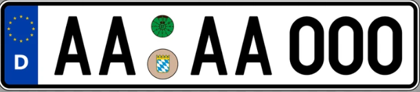
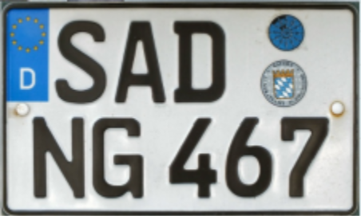
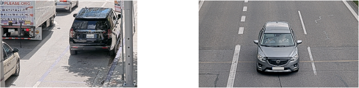

# Camera Mounting Recommendations

## Camera Mounting Angle

The ideal camera's mounting angle is **30°**.

This ensures that the camera captures the desired field of view without excessive tilting, which can affect the accuracy of the captured data.

## Horizontal License Plate Alignment

It is crucial to align the license plate image horizontally within the camera's field of view.

The license plate should not be tilted more than **10° horizontally**.

If the image appears tilted beyond this threshold, it is recommended to adjust the camera's position so that the license plate appears horizontally in the live stream.

## Minimum License Plate Size

### Recommended License Plate Size for different plate types

| Plate Type | Example | FHD | 4K |
|------------|---------|-----|----|
| USA License plate with stacked characters | Pennsylvania | 140-350 px | 140-500 px |
| USA 1-line License plate | California | 90-350 px | 130-500 px |
| 1-line EU, TUR, ISR, South American plates | Germany | 80-350 px | 120-500 px |
| 2-line EU plates | Germany (2-line) | 80-350 px | 110-500 px |
| GCC long plates | UAE/Oman | 90-350 px | 120-500 px |
| GCC short plates | UAE/Oman | 80-350 px | 110-500 px |
| GCC motorcycle plates | UAE/Oman | 80-350 px | 110-500 px |
| 2-line GCC KSA plates | Saudi Arabia | 120-350 px | 120-500 px |

## Optimal Camera Installation Point

