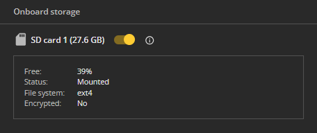

# Storage (SD-card) Recommendations

CAMMRA AI supports both internal storage and SD card storage.

:::tip Recommended
It is **recommended to use an SD card**, especially in traffic solutions where data is transferred to external systems, to prevent data loss during connectivity issues.
:::

## Why Use an SD Card?

- **Traffic monitoring environments**: In high-density areas with frequent license plate detection, an SD card helps prevent data loss during connectivity issues or heavy traffic conditions.

- **Camera storage management**: The application continuously interacts with the camera's internal memory. If that memory becomes full, the application may be unable to save new data, resulting in the potential loss of information.

- **System stability**: When internal memory is overloaded, some cameras may perform a hard reset as a protective measure. Using an SD card helps mitigate this risk.

- **Storage capacity**: Without an SD card, the CAMMRA AI application can store a limited number of events based on image settings:
  - **Full Frame** – up to 3 images
  - **Vehicle Crop** – up to 10 images
  - **License Plate Crop** – up to 1,000 images

With an SD card installed, the application can store up to **100,000 events**.

## SD Card Usage

- SD card must be installed, mounted, and formatted via:
  - **Camera Web Page** > **System** > **Storage**

- Recommended SD card: **128 GB** for full-frame image storage.
- Restart the CAMMRA AI application after inserting the SD card.
- Do **not disable** the SD card while CAMMRA AI is running.
- Application will auto-switch to SD card when detected.

## Event Storage Capacity

Storage needs depend on the selected image type:

- **License Plate (LP) crops**
- **Vehicle crops** (includes LP crops)
- **Full Frame images** (includes LP crops)

:::note
**Image sizes may vary significantly** depending on:
- Lighting conditions
- Scene complexity
- JPEG compression quality
- Motion or blur in the frame
:::

*Assumes maximum file sizes: LP = 10 KB, Vehicle = 300 KB, Full Frame = 550 KB*

| SD Card Size | Usable Space | Vehicle Crop Events | Full Frame Events |
|--------------|--------------|---------------------|-------------------|
| **8 GB**     | ~7.5 GB      | ~25,000             | ~13,700           |
| **16 GB**    | ~15 GB       | ~50,000             | ~27,500           |
| **32 GB**    | ~30 GB       | ~100,000            | ~54,000           |

:::warning Important
- **Maximum CAMMRA AI database size: 100,000 events**
- Continuous video recording can consume multiple GBs, reducing space for event storage.
- Always plan capacity based on image type and expected usage.
:::

The tables consider the growing database size, ensuring safe and realistic planning for CAMMRA AI long-term operation.

## Internal Storage Limitation

If no SD card is present, internal storage supports only:

- **3 Full Frame images**
- **10 Vehicle crop images**
- **1,000 LP crops**
