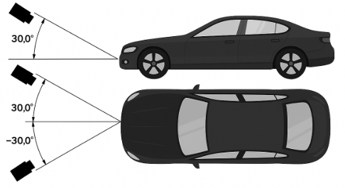
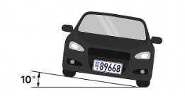

# Camera Mounting Recommendations

## Camera Mounting Angle

The ideal camera's mounting angle is **30°**. This ensures that the camera captures the desired field of view without excessive tilting, which can affect the accuracy of the captured data.

## Horizontal License Plate Alignment

It is crucial to align the license plate image horizontally within the camera's field of view. The license plate should not be tilted more than **10° horizontally**. If the image appears tilted beyond this threshold, adjust the camera's position so that the license plate appears horizontally in the live stream.

## Minimum License Plate Size

CAMMRA AI 2.0 supports both **FHD (1080p)** and **4K** resolutions with the following plate size requirements:

| Plate Type | FHD (1080p) | 4K |
|------------|-------------|----|
| **USA License plate with stacked characters** | 140-350 px | 140-500 px |
| **USA 1-line License plate** | 90-350 px | 130-500 px |
| **1-line EU, TUR, ISR, South American plates** | 80-350 px | 120-500 px |
| **2-line EU plates** | 80-350 px | 110-500 px |
| **GCC long plates** | 90-350 px | 120-500 px |
| **GCC short plates** | 80-350 px | 110-500 px |
| **GCC motorcycle plates** | 80-350 px | 110-500 px |
| **2-line GCC KSA plates** | 120-350 px | 120-500 px |

## Optimal Camera Installation Point

:::tip
For best results, position the camera so that the entire vehicle fits within the Region of Interest (ROI), with the license plate clearly visible and meeting the minimum size requirements.
:::
