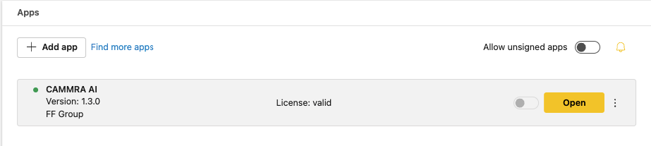
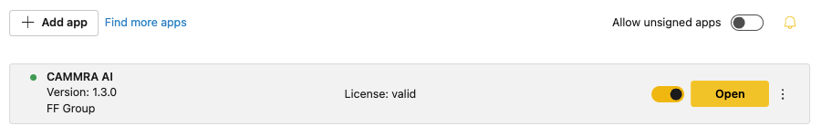

# Installing CAMMRA AI

To access and manage applications on the camera's webpage, follow these steps:

## Step 1: Open the Camera's Webpage

Launch a web browser and enter the IP address or hostname of the camera to access its webpage.

## Step 2: Navigate to Application Settings

Within the camera's web interface, locate the Main settings menu on the left, find and select the **Apps** option. This will direct you to the application management page.

## Step 3: Install the Application

To install the app:
1. Click on the **"+ Add app"** button
2. Upload the installation file (*.eap)
3. Activate the license with a code from your supplier

For license activation, navigate to the right menu (three dots) and choose:
- **Automatic activation** - if camera has access to the Internet
- **Offline activation** - with a key generated from the [Axis license key registration portal](https://www.axis.com/en-gb/support/license-key-registration#/registration)

Once installed, the menu looks like this:

## Step 4: Run the Application

Run the CAMMRA AI Application by sliding the switch button.

## Step 5: Open the Application

Once CAMMRA AI is running, click on the **Open** button. This will initiate the application and open it for configuration and usage.

:::note
First launch takes longer to initiate. Wait until the live image appears, then the app is ready to operate.
:::
