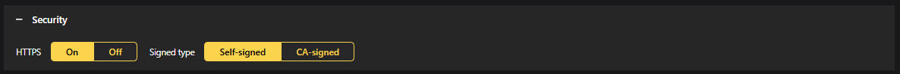

# 2N IP Base Intercom Integration

Configure CAMMRA AI to send data to 2N devices for intercom and access control.

## Configuration Steps

### Step 1: Select Integration Type

Go to **Direct integration** and choose **2N IP device** from the drop-down menu.

### Step 2: Configure URL

Specify the URL IP address of your 2N device.

:::important
Use HTTPS and make sure to switch On **Self-signed** in Settings > Security section.
:::

### Step 3: Configure Barrier Direction

Choose whether the Barrier is used for **Entry** or **Exit**.

### Step 4: Enter Credentials

Enter the username and password of your 2N device.

### Step 5: Select Vehicle Direction

Choose direction:
- **IN** - Incoming vehicles
- **OUT** - Outgoing vehicles  
- **ANY** - Both directions

### Step 6: Enable and Save

Enable the integration and save the configuration.

## Verification

If the integration is properly configured, in 2N you should see something like this:

