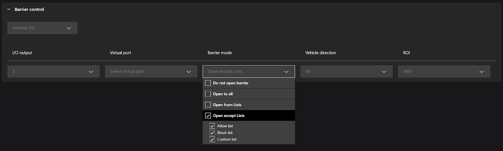
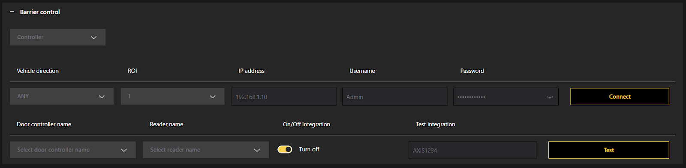
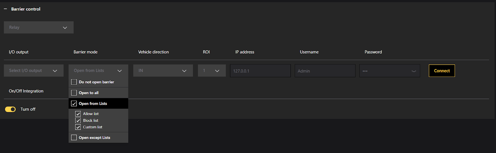

# Barrier Control Scenario

Enable automated gate access using CAMMRA AI plate recognition and external hardware integration. Configure barrier logic for vehicle access based on license plate lists.

## Overview

CAMMRA AI Barrier Control allows you to automate vehicle gate access by integrating with external devices such as controllers, relays, or internal I/O ports. License plates can be verified against Allow, Block, or Custom lists to control access.

In a barrier control scenario, CAMMRA AI uses license plate recognition to detect vehicle plates and determine whether to trigger barrier access based on pre-configured permissions. The AI verifies plates against internal allow lists or block lists and communicates with a barrier system using I/O or relay connections.

The barrier is automatically opened for authorized vehicles and can remain closed for unauthorized ones. CAMMRA AI can be deployed at entry or exit points for car parks, gated communities, or secured premises.

## Barrier Control Type

In the Settings > Barrier control drop down menu > Select the barrier integration type:

- **Internal I/O**: Uses device's onboard I/O ports.
- **Controller**: Connects to a third-party controller over IP (e.g., via HTTP/HTTPS).
- **Relay**: Triggers physical relays via I/O output.

## Control Methods Overview

| Method | Hardware Needed | Use Case |
|--------|-----------------|----------|
| Internal I/O | Axis camera w/ I/O ports | Select the camera's internal output port connected to the physical barrier. |
| Controller | External access controller | Integrate with door/gate access control systems |
| Relay Module | Networked relay device | Flexible control via external relays |

## A. Barrier Control via Internal I/O

In this scenario, CAMMRA AI is configured to automatically open a barrier for specific vehicles based on license plate recognition and logic defined in the Barrier Control settings. The barrier is triggered using the camera's **internal I/O port**.

This mode is ideal when you want CAMMRA AI to act as a self-contained access controller without requiring an external relay or controller module.

### Configuration Steps (Internal I/O)

1. **Go to** Barrier Control in CAMMRA AI settings.

2. **Set Type:** Internal I/O (to use the built-in camera I/O ports for barrier control).

3. **Select I/O Output:** Choose the port physically connected to the gate or barrier system.

4. **(Optional) Select Virtual Port:** If using virtual triggers (e.g., software-based event logic), assign a virtual port.

5. **Set Barrier Mode:**
   - **Do not open barrier:** No access is granted, even if plates are detected.
   - **Open to all:** Barrier opens for every detected vehicle.
   - **Open from Lists:** Opens only for license plates on selected lists.
     - You can select from:
       - ☐ Allow List
       - ☐ Block List
       - ☐ Custom List
   - **Open except Lists:** Opens for all plates **except** those on selected lists.

6. **Vehicle Direction:** Define the direction of travel to trigger the barrier:
   - **IN:** Only incoming vehicles trigger the logic.
   - **OUT:** Only outgoing vehicles trigger the logic.
   - **ANY:** Trigger for both directions.

7. **Region of Interest (ROI):** Choose the detection zone where license plates should be recognized. Example: 1 for Entry Lane A, 2 for Exit Lane B.

### Example Use Case: Open Barrier for Authorized Entries Only

If you want to **open the barrier only for vehicles in the Allow List** and **only when entering**:

- **Type:** Internal I/O
- **I/O Output:** 5 (example)
- **Virtual Port:** None
- **Barrier Mode:** Open from Lists
  - ✓ Allow List
- **Vehicle Direction:** IN
- **ROI:** 1

Ensure that vehicles are properly added to the Allow List under **List Management**.

## B. Controller (Third-Party Access Controller)

Use when integrating CAMMRA AI with a third-party access controller over the network.

### Use Case

Ideal for setups where the gate or barrier is controlled via an external access management system (e.g., Axis A1001, Bosch).

### Configuration Fields:

- **Vehicle direction:** Defines camera direction — IN, OUT, or Any.
- **ROI:** Region of Interest; select which detection zone this configuration applies to.
- **IP address:** IP of the access controller.
- **Username / Password:** Used for controller authentication.
- **Connect:** Verifies login and retrieves available controller and reader.
- **Door controller name:** Select controller (fetched after connect).
- **Reader name:** The reader/door endpoint to trigger.
- **On/Off Integration:** Enables/disables integration runtime.
- **Test Integration:** Sends a test signal to ensure connectivity.

### Operation:

- When a license plate matches a configured list (based on barrier mode), a request is sent to the access controller to open the door/barrier.
- The system does **not forward the license plate as a credential**.
- The controller must be pre-configured to treat the reader event as a trigger (CAMMRA AI does not create or manage identities/credentials in the controller).

## C. Relay Output (I/O Trigger)

Use when camera directly controls a barrier using a hardware relay. When the camera is connected to a relay box or onboard I/O ports.

### Use Case:

For simple installations where a dry contact signal is sufficient to trigger a gate/barrier (without access management software)

### Requirements:

1. Camera physically installed and connected to the network.
2. CAMMRA AI is up and running on the Axis camera.
3. Cables connected between the barrier and the relay module.
4. Basic setup done (See section how to configure ROI and other parameters).

### Configuration Fields:

- **I/O Output #:** Select hardware output (relay) to be activated.
- **Barrier mode:** Defines which lists allow access (check you Allow, Block, Custom List).
- **Vehicle direction:** IN, OUT, or Any.
- **ROI:** Region of detection.
- **IP address:** Enter the IP address for the relay module in format 192.168.0.0
  - Username for the relay module
  - Password for the relay module
- **On/Off Integration:** Enables/disables relay triggering logic.

### Behavior:

- When the detected plate matches configured logic (based on list and mode), CAMMRA AI triggers the output for a fixed pulse duration (usually 1-2 seconds).
- Relay behavior is binary: activate or not, based on plate match.
- No feedback from the relay (CAMMRA AI does not verify if the gate physically opened).
