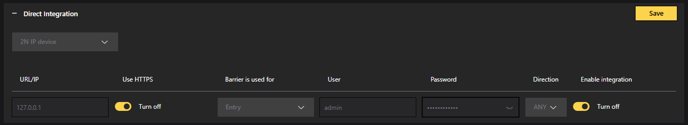

# Direct Integration

Direct integration section is dedicated to integrations to 3rd party systems, which requires sending in different format / protocol, than CAMMRA AI provides on its own.

## CAMMRA AI configuration for Genetec Security Center integration

To configure CAMMRA AI sending data to Genetec via 3rd party ALPR plugin:

1. Go to Direct integration and choose Genetec from the drop-down menu.

2. Fill url `https://<hostname>/api/v1/lpr/LprIngestion/reads`

Then choose any Camera ID name and user's credentials.

:::note
In Genetec integration it's not possible to choose the event type. CAMMRA AI sends lost events only.
:::

3. Toggle Turn On button to the right to Enable integration.

4. Use HTTPS and make sure to switch On Self-signed in the Settings > Security section.

5. In **Settings > Image settings > Screenshot to save > Frame type** choose the type of image which will be displayed in Security Desk as a part of read. Standard content of every read is text form of the License plate, date and time information and License plate crop. It is recommended to add Full frame or Downsized frame image to have a context view.

### Screenshot Options

- **License plate crop** - Shows only the license plate area
- **Vehicle crop** - Shows the vehicle area
- **Frame downsized** - Shows a reduced size full frame
- **Full frame** - Shows the complete camera frame

For instructions how to setup this integration on Genetec side, follow-up [this instruction](https://customerhub.ff-group.ai/portal/en/kb/articles/integration-to-genetec).

---

## 2N IP Base Intercom integration

To configure sending data to 2N via 3rd party ALPR plugin, go to Direct integration and choose 2N IP device from the drop-down menu.

**Step 1.** Specify the URL IP address of your 2N device, use HTTPS and make sure to switch On Self-signed in the Settings > Security section.

**Step 2.** Choose Barrier is used for Entry or Exit

**Step 3.** Enter user name and password of your 2N device

**Step 4.** Choose direction: IN, OUT or ANY

**Step 5.** Enable and save the config.

If integration is properly configured, in 2N you should see something like this:

