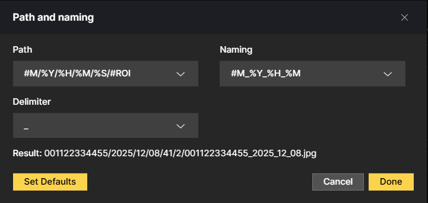

# FTP Integration - Path and Naming

The Path and Naming section in the CAMMRA AI FTP Integration tab defines how images are stored on the FTP server. It controls both the directory structure and the filename format using dynamic variables.

## Configuration Fields

### Path
Defines the folder hierarchy on the FTP server.

### Naming
Defines the image filename format.

### Delimiter
Specifies the character used to separate values in the filename (for example `_` or `-`).

### Result Preview
Displays the final generated path and filename based on the current configuration.

## Available Variables

### Path Variables

| Variable | Description |
|----------|-------------|
| `#M` | The Axis product's full-length MAC address |
| `%Y` | Four-digit year number |
| `%H` | Hours in two-digit 24-hour clock format (00-23) |
| `%M` | Minutes as a two-digit number (00-59) |
| `%S` | Seconds as a two-digit number (00-59) |
| `%v` | Milliseconds as a three-digit (000-999) |
| `%m` | Month in two-digit format (01-12) |
| `%b` | Name of the month as a three-letter abbreviation |
| `%d` | Day of the month in two-digit format (01-31) |
| `#ROI` | Number of ROI (1 or 2) |
| `#DIR` | Vehicle direction (IN, OUT, UNK) |
| `#PLATE_ID` | Internal detected vehicle number |
| `#DEVICE_ID` | Camera Device ID |
| `#PLATE` | Recognized license plate |
| `#COUNTRY` | Recognized country |

## Common Variables

- `#M` - Camera MAC address
- `%Y` - Year, `%m` - Month, `%d` - Day
- `%H` - Hour, `%M` - Minutes, `%S` - Seconds
- `%v` - Milliseconds

## Example

With the configuration:
- **Path:** `#M/%Y/%H/%M/%S/#ROI`
- **Naming:** `#M_%Y_%H_%M`
- **Delimiter:** `-`

**Result:** `001122334455/2025/12/08/41/2/001122334455_2025_12_08.jpg`
