# Integration to Genetec

## Video Instruction

Additionally, CAMMRA's meta-data has also integration with a unified security platform.

**Genetec Security Center** to manage and integrate physical security systems such as access control, automatic license plate recognition, and more.

This quick guide describes how to set up both Genetec Security Center and CAMMRA / CAMMRA Lite ACAP app from FF Group to send LPR reads to Genetec.

CAMMRA direct integration with Genetec is now complete, so all data recognized by CAMMRA are available in Genetec Security Center (license plate, make, type and colour and GPS coordinates).

## Setting up direct CAMMRA integration with Genetec Security Center

### Genetec Configuration

First off all, check that entire system is online:

1. Go to `https://<your_ip_address>/Genetec`
2. Make sure that **Database**, **Directory** and **License** is online

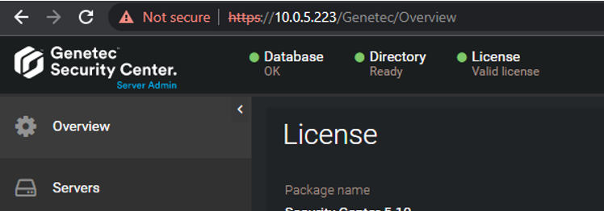

If not, run all Genetec and SQLEXPRESS services:

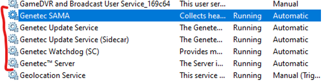

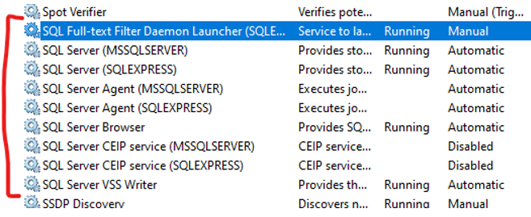

### Install LPR Plugin

We need to download installer by the link below, install it and proceed to the next step:

[LPR plugin install](https://portal.genetec.com/s/package-detail?appId=a1p5W00000Bz0FhQAJ&Id=aAU5W000000CcKfWAK)

### Configure LPR Plugin

1. Open **Genetec™ Config Tool >>> Plugins**
2. Press **Add an entity >>> Plugin** and choose **LPR plugin** then next next next
3. Select added **LPR plugin** and go to **Data sources** tab and configure field like this:

| Field | Value |
|-------|-------|
| Enabled | ✅ |
| Name | Plugin REST API |
| API path prefix | lpr |
| REST port | 443 |
| WebSDK host | localhost |
| WebSDK port | 443 |
| Allow self signed certificates | ✅ |
| Effective address | `https://<hostname>/api/v1/LprPlugin/LprIngestion/reads` |

Also configure:

| Field | Value |
|-------|-------|
| Enabled | ✅ |
| Name | Security Center Lpr Events |
| Processing frequency | 5 sec |

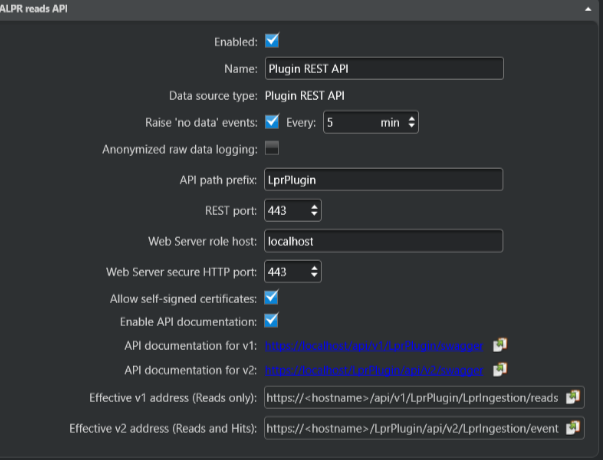

### Configure Data Sinks

1. Go to **Data sinks** tab
2. Click on plus ➕ sign and choose **Database** type

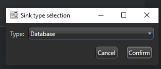

Configure database:

| Field | Value |
|-------|-------|
| Activated | ✅ |
| Source | Plugin REST API ✅ |
| Name | Reads DB |
| Include: Reads | ✅ |
| Include: Hits | ✅ |
| Include: Images | ✅ |
| Thumbnails | ✅ |
| Image storage: Save image to disk | ✅ |
| Selected folder | C:\Genetec\LPR Images |

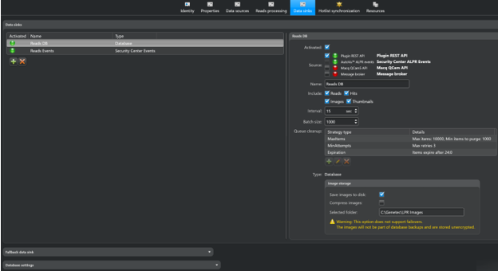

3. Still on the **Data sinks** tab click on plus sign ➕ and choose **Security Center Events** type

Configure database:

| Field | Value |
|-------|-------|
| Activated | ✅ |
| Source | Plugin REST API ✅ |
| Name | Reads Events |
| Include: Reads | ✅ |
| Include: Hits | ✅ |
| Include: Images | ✅ |

### Create an API User

1. Go to **Config Tool >>> User Management** and **Add an entity** User.
2. Enter User name and Password; Leave other fields without any changes
3. Select added user and go to **Privileges** tab allow the **Third-party ALPR reads**

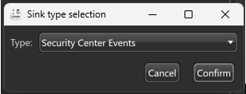

**API** privilege and whole section of **Application privileges** then click **Apply**

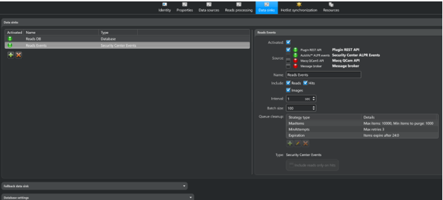

## CAMMRA Configuration

1. Go to **Integration tab >>> Integration** and select **Genetec Security Center**
2. Fill url `https://<hostname>/api/v1/LprPlugin/LprIngestion/reads` - Can be copied from GSC Config Tool – System – Roles – LPR Plugin – Data Source – ALPR reads API – Effective address
3. Respective your Latitude, Longitude, Camera ID name and user's credentials.

4. In **Events types settings** checkmark New.
5. In **Conditions** set your preferences.
6. In **Events Buffer** you may put the default Buffer size and Events TTL.
7. Tick the checkbox **Send event data to server**.
8. Turn on integration by pressing the **Save** button.
9. In **Settings** tab >>> Advanced settings select **Allow self-signed certificates** in **Security** section and press the **Save** button.

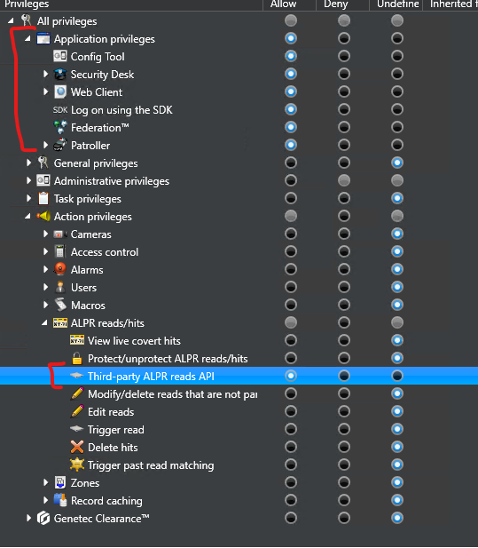

10. In **Settings** >>> Frame type choose the type of image which will be displayed in Security Desk as a part of read. Standard content of every read is text form of the License plate, date and time information and License plate crop. It is recommended to add Full frame or Downsized frame image to have a context view.

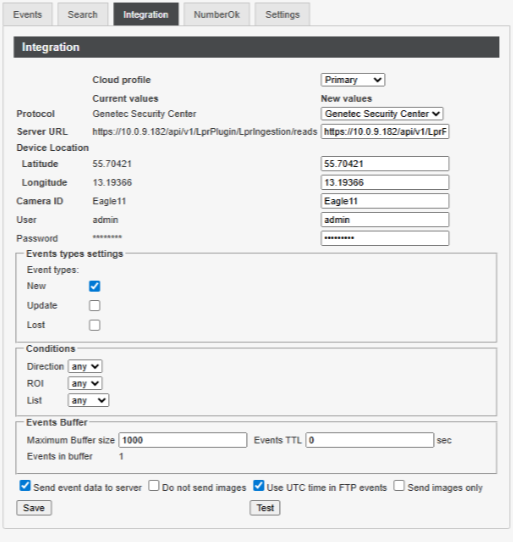

## See Report & Live Events

### Generate Reports

1. Open **Genetec™ Security desk** 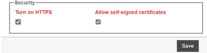
2. In **Investigation** section click on **Reads**

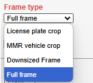

3. On **Reads** tab select needed filters and click **Generate report**

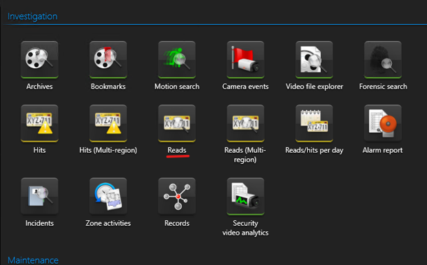

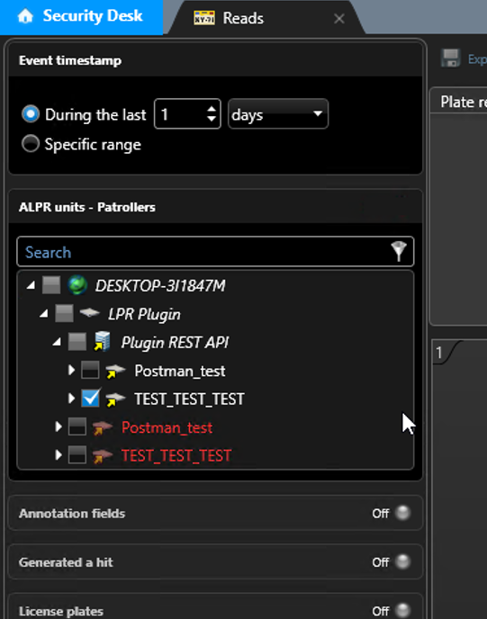

### View Live Events

In order to see Live Events go to **Operations** in Security Desk and click on **Monitoring**

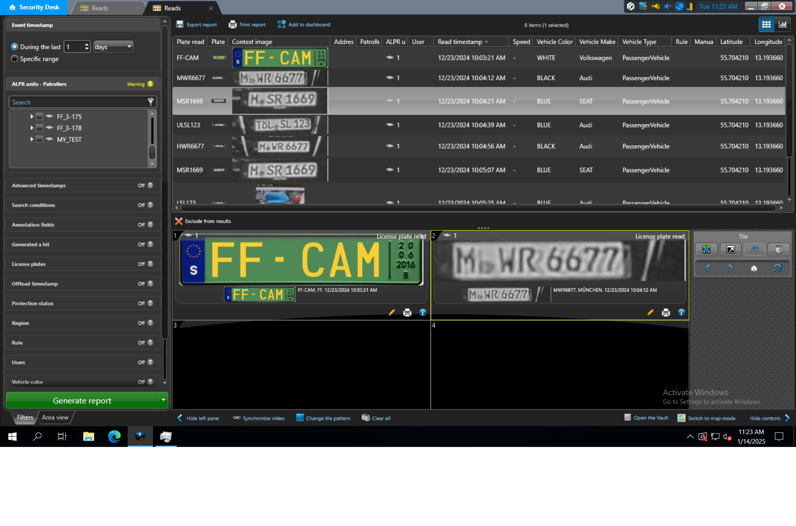

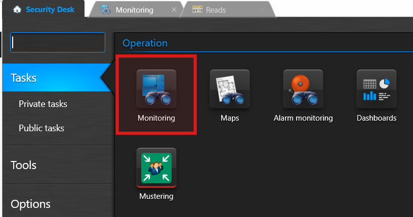
