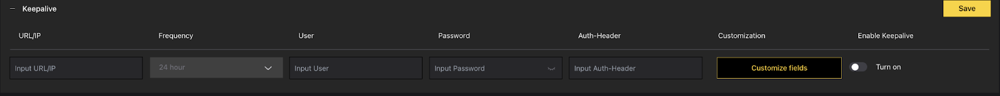

# Keepalive

There is also possibility to setup keepalive service for to send keepalive messages to server/cloud receiver. This service could also use authentication (username, password, auth. header) as any other push events.

User can customize the content of the keepalive message by clicking on the button "Customize fields" and choosing appropriate content in the subordinated menu.

Also a frequency of sending is configurable.

For to start sending these event, turn on the slider and click on "Save".

By pressing Customize fields, you can choose additional information which can be included in the Keepalive message: Timestamp, Mac Address, Device ID, App version or OS version.

## Available Fields

- **Timestamp** - Current time when keepalive is sent
- **Mac Address** - Camera MAC address
- **Device ID** - Unique device identifier
- **App version** - CAMMRA AI application version
- **OS version** - Operating system version
