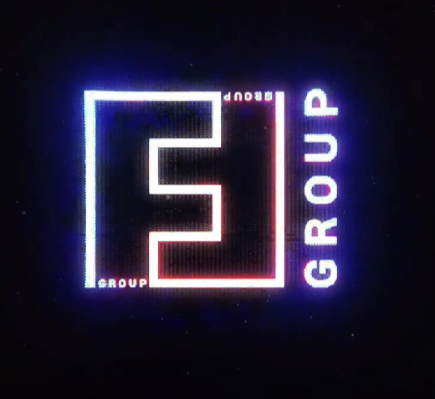

# CAMMRA AI Links

## Download Links

1. [CAMMRA AI latest release](https://workdrive.zohoexternal.com/external/c917d57f5d7e1794d367e14f086f9294b02e94ff9e4661600ad7ee7d6e76b7a3) - Download the latest version
2. [CAMMRA AI with speed measurement - special release](https://workdrive.zohoexternal.com/external/bc5ff06835435a4000244110fe8a51026322828111da3fd6dc9f81a13302ba00) - Version with radar speed measurement support

## Documentation

- [Complete product manual](/docs/cammra-ai-2.0-manual)
- [Release notes](https://workdrive.zohoexternal.com/external/writer/cd5854814f595ed93f6ebb9b5d9a574d31c26195908d0530b865479f81b79e8c)
- [Quick installation guide](https://workdrive.zohoexternal.com/external/fdb34a24c2d423039c71447584b323738545a50149f3d573e1e91db9f8eba0b9)
- [Axis product information](https://docs.google.com/spreadsheets/d/1j24lx8lrI4z_eGXliojJwLRov3znm8Oc0se3622Dhi0/edit?gid=0#gid=0) - To understand camera parameters including ARTPEC version, resolution, memory, etc.

## Support

For technical support, please visit the [FF Group Customer Hub](https://customerhub.ff-group.ai/portal/en/home) or contact us at support@ff-group.ai.

## Marketing material
- [Datasheet]("/files/CAMMRA AI datasheet.pdf")

### Video

  <iframe
    src="https://www.youtube.com/embed/_jEaslCO-rk"
    title="YouTube video"
    frameborder="0"
    allow="accelerometer; autoplay; clipboard-write; encrypted-media; gyroscope; picture-in-picture"
    allowfullscreen
    style="position: absolute; top: 0; left: 0; width: 100%; height: 100%;"
  ></iframe>

