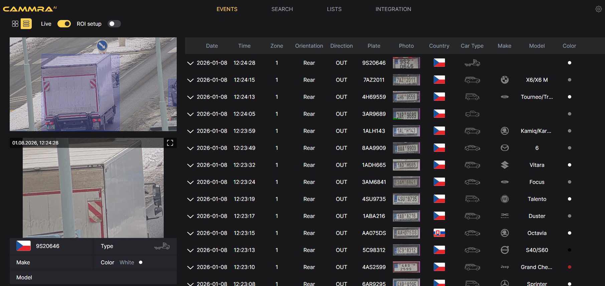

# CAMMRA AI 2.0 Full Manual


**CAMMRA AI** is an AI-based data fusion application for vehicle data recognition, developed for Axis cameras with ARTPEC-8 and ARTPEC-9 processors.

This comprehensive manual covers installation, configuration, and integration of CAMMRA AI.

---

## Table of Contents

1. [Product Overview](#1-product-overview)
2. [Supported Cameras](#2-supported-cameras)
3. [Camera Mounting & Settings](#3-camera-mounting--settings)
4. [Installation](#4-installation)
5. [Application Setup](#5-application-setup)
6. [List Management](#6-list-management)
7. [Integration](#7-integration)
8. [Appendix](#8-appendix)

---

## 1. Product Overview

CAMMRA AI is an advanced application developed for Axis cameras with ARTPEC-8 and ARTPEC-9 processors. Leveraging the capabilities of the ACAP (Axis Camera Application Platform) and DLPU (Deep Learning Processing Unit), it runs several neural networks in parallel on board these cameras.

### Key Features

- **License Plate Recognition (LPR)** - Front and rear view recognition
- **Vehicle Make, Model, Color Recognition (MMR)** - AI-powered vehicle identification
- **Vehicle Type Detection** - Car, truck, motorcycle, bus, etc.
- **No-Plate Detection** - Detect vehicles without visible license plates
- **Speed Measurement** - Integration with Axis radar (DLE cameras)
- **Sound Measurement** - Integration with Sorama units for vehicle loudness

### Use Cases

- City and highway traffic monitoring
- Law enforcement and stolen vehicle tracking
- Access control and parking management
- Traffic statistics and analytics
- Mobile installation in vehicles

### Integrations

CAMMRA AI integrates with:
- **FF DataFactory** - Data fusion platform for centralized meta-data
- **Video Management Systems** - Via VAPIX events
- **Law Enforcement Databases** - Safercities (NZ), SNIPR/Platform 1 (SA), Fusus, Auror
- **National Databases** - Belgium, UK, Australia via Macq M3 and Jenoptik
- **Access Control Systems** - Genetec, 2N, barrier controllers

:::tip Server-less Architecture
The solution is fully server-less - all analytics are performed on-edge using camera processing power.
:::

---

## 2. Supported Cameras

CAMMRA AI requires an Axis camera with **ARTPEC-8** or **ARTPEC-9** processor.

### Recommended Cameras

| Camera Model | Use Case |
|--------------|----------|
| [AXIS Q1800-LE](https://www.axis.com/products/axis-q1800-le) | **Top choice** |
| [AXIS Q1805-LE](https://www.axis.com/products/axis-q1805-le) | Longer distance |
| [AXIS P1465-LE 29mm](https://www.axis.com/products/axis-p1465-le) | Shorter distance |
| [AXIS P3265-LVE 22mm](https://www.axis.com/products/axis-p3265-lve) | Shorter distance |
| [AXIS Q1686-DLE](https://www.axis.com/products/axis-q1686-dle) | Radar-Video Fusion, longer distance |
| [AXIS Q1656-DLE](https://www.axis.com/products/axis-q1656-dle) | Radar-Video Fusion, shorter distance |

### Other Supported Cameras

- P1465-LE 9mm
- P3265-LVE 9mm
- P3267-LVE
- P3268-LVE
- P1467-LE
- P1468-LE
- Q1806-LE
- Q1808-LE
- P1518-LE

:::note Sensor Selection
CAMMRA AI uses camera sensor #1 by default, except for AXIS P1518-E and P1518-LE cameras where sensor #2 is used (sensor #1 is wide-angle).
:::

---

## 3. Camera Mounting & Settings

### 3.1 Mounting Recommendations

#### Camera Mounting Angle

The ideal camera mounting angle is **30°**.


#### Horizontal License Plate Alignment

The license plate should not be tilted more than **10° horizontally**. Adjust the camera position if the plate appears tilted.


#### Minimum License Plate Size


##### Recommended License Plate Size by Region

| Plate Type | FHD | 4K |
|------------|-----|----|
| USA License plate with stacked characters | 140-350 px | 140-500 px |
| USA 1-line License plate | 90-350 px | 130-500 px |
| 1-line EU, TUR, ISR, South American plates | 80-350 px | 120-500 px |
| 2-line EU plates | 80-350 px | 110-500 px |
| GCC long plates | 90-350 px | 120-500 px |
| GCC short plates | 80-350 px | 110-500 px |
| GCC motorcycle plates | 80-350 px | 110-500 px |
| 2-line GCC KSA plates | 120-350 px | 120-500 px |

#### Installation Examples


### 3.2 Optimal Camera Settings

| Setting | Recommended Value |
|---------|------------------|
| **Autofocus** | Set area to cover license plate, fine-tune manually |
| **Wide Dynamic Range** | **Disabled** |
| **Contrast** | 65 |
| **Local Contrast** | 65 |
| **Tone Mapping** | 20 |
| **IR-Cut Filter** | Auto |
| **Max Shutter** | 1/500 (daytime), 1/1000 (nighttime for headlight glare) |
| **Max Gain** | 21 dB (reduce to 9 dB if overexposed) |
| **Lock Aperture** | Disabled |

#### Resolution Recommendations

| Lanes | Resolution |
|-------|------------|
| One lane | Full HD (1920x1080) |
| Two lanes (NA/GCC plates) | 4K (3840x2160) |
| Two lanes (EU/SA plates) | Full HD (1920x1080) |


### 3.3 Additional Mounting Recommendations

#### IR LEDs for Nighttime Operation

Ensure the camera is equipped with IR LEDs for nighttime license plate recognition.

#### Shutter Speed

Set shutter speed high enough to suppress glare from vehicle headlights at night. **1/1000** is typically recommended.

:::caution
Excessively high shutter speeds may blur fine details like character edges on license plates.
:::

#### Sunlight Considerations

When selecting mounting location, consider sunrise and sunset angles. Direct sunlight can significantly distort the image.

#### Pole Stability

If mounted on a roadside pole, verify stability under real traffic conditions. Some poles vibrate when heavy vehicles pass, making recognition unreliable.

#### Day/Night Verification

Always verify performance at night after optimizing daytime settings, and vice versa.

:::warning Night Mode Limitation
At night, when the camera switches to black-and-white mode, Make/Model Recognition (MMR) and color detection are disabled.
:::

### 3.4 Storage (SD Card) Recommendations

:::tip Recommended
Use an **SD card** to prevent data loss during connectivity issues.
:::

#### Why Use an SD Card?

- Prevents data loss in high-density traffic environments
- Avoids camera storage issues and potential resets
- Increases storage capacity from ~1,000 events to **100,000 events**

#### SD Card Configuration

Install, mount, and format via: **Camera Web Page > System > Storage**


- Recommended: **128 GB** for full-frame storage
- Restart CAMMRA AI after inserting SD card
- Do **not disable** SD card while running

#### Storage Capacity

| SD Card Size | Usable Space | Vehicle Crop Events | Full Frame Events |
|--------------|--------------|---------------------|-------------------|
| 8 GB | ~7.5 GB | ~25,000 | ~13,700 |
| 16 GB | ~15 GB | ~50,000 | ~27,500 |
| 32 GB | ~30 GB | ~100,000 | ~54,000 |

:::warning
**Maximum database size: 100,000 events**. After reaching this limit, older events are overwritten.
:::

#### Internal Storage Limits (No SD Card)

- 3 Full Frame images
- 10 Vehicle crop images
- 1,000 LP crops

---

## 4. Installation

### 4.1 Installing CAMMRA AI

1. Open the Camera's Webpage
2. Go to **Apps** menu
3. Click **+Add app**
4. Select the CAMMRA AI installation file
5. Activate the license:
   - Click the **three dots** menu
   - Choose **"Activate license automatically"**
   - Enter your license code and click **"Activate"**
6. Click **Open** or **Launch**




### 4.2 Power Handling

:::danger Warning
While the application is running, the power source should **not** be disconnected. The application continuously works with storage and may send events to external servers. Interrupting power may result in unpredictable behavior.
:::

---

## 5. Application Setup

### 5.1 Region of Interest (ROI) Setup

1. Access the CAMMRA AI web page
2. Navigate to ROI Setup
3. Define Regions of Interest:
   - Keep ROIs as small as possible
   - Avoid placing ROIs at image edges
4. Set car movement direction (orient arrow with traffic flow)


### 5.2 Location Setup


1. **Region:** Select deployment region
   - Europe, North America, South America, USA, Mexico, Canada
   - GCC, Indonesia, Australia, New Zealand
   - Taiwan, Vietnam, Hong Kong, South Africa

2. **Preferred Country:** Select camera location country

3. **Preferred State:** (USA, Canada, Mexico only)

:::note
Preferred country/state helps classify plates more accurately but doesn't limit recognition.
:::

### 5.3 Image Settings


1. **Resolution:**
   - 1920x1080 (Full HD)
   - 2560x1440
   - 3840x2160 (4K - experimental/BETA)

2. **Saved Image Size:** Configure based on storage capacity and quality needs

3. **Overlay Text:** Enable to display date, time, license plate, and vehicle info

### 5.4 Recognition Parameters


| Parameter | Description | Recommended |
|-----------|-------------|-------------|
| **Plate Width Min/Max** | License plate size range | Use defaults |
| **Number of Symbols** | Min/max characters | Keep narrow |
| **Result Delay** | Wait time after first detection | Default |
| **LPR Confidence** | Minimum confidence threshold | 0.4 |
| **MMR Confidence** | Make/model confidence | 10 |
| **No Plate Detection** | Detect vehicles without plates | BETA |
| **Blacklist Comparison** | Strict or Soft (1-2 char difference) | Soft (default) |

### 5.5 Settings for Stored Events


**Event Types to Store:**
- **All** - All events
- **Allow listed** - Whitelisted plates only
- **Block listed** - Blacklisted plates only
- **None** - Don't store (send to third-party only)

**Storage Duration:**
- No limit (depends on storage)
- 1 day / 7 days / 30 days

### 5.6 Backup & Restore


- **Backup configuration** - Save all settings including license
- **Restore configuration** - Restore from backup file
- **Clear all recognition results** - Remove stored data

### 5.7 Security Configuration


- **HTTPS:** Enable/disable encryption
- **Signed Type:** Self-signed or CA-signed certificate

---

## 6. List Management


### Available Lists

- **Allow List** - Whitelisted plates (trigger allow events)
- **Block List** - Blacklisted plates (trigger block events)
- **Custom List** - For specific use cases

### Adding License Plates

1. Navigate to **LISTS** tab
2. Enter license plate number or pattern:
   - Use `?` for single character wildcard: `SL???`
   - Use `*` for multiple characters: `M*`
3. Optionally add description

### Camera Synchronization

Share license plate lists across cameras:

1. Enter target camera IP, username, password
2. Click **Add** to include camera
3. Click **Camera Synchronization**
4. Verify **Last Sync** timestamp

:::warning
Synchronization **overrides** existing lists on target camera.
:::

---

## 7. Integration

### 7.1 VAPIX Events

CAMMRA AI supports VAPIX events for VMS integration.

#### Supported Events

| Event | Description |
|-------|-------------|
| `LPR` | General event with all metadata |
| `LPR.Allow_list` | Plate matches Allow list |
| `LPR.Block_list` | Plate matches Block list |
| `LPR.Custom_list` | Plate matches Custom list |
| `LPR.NotInList` | Plate not in any list |
| `LPR.PlateIN` | Incoming plate detected |
| `LPR.PlateOUT` | Outgoing plate detected |
| `LPR.New` | First detection |
| `LPR.Update` | Data update |
| `LPR.Lost` | Vehicle left frame |
| `VMMCR` | Vehicle Make/Model/Color |
| `VMMCR.Truck` | Truck detected |

### 7.2 Push Events (HTTP POST / TCP)


1. Select **INTEGRATION** tab
2. Choose profile (up to 3 supported)
3. Select protocol: **TCP** or **HTTP POST**
4. Configure server URL
5. Set Device ID
6. Select event types:
   - **New** - First detection
   - **Reliable** - Consolidated actionable result
   - **Update** - Data changes
   - **Lost** - Vehicle left frame (10+ seconds)

### 7.3 FTP Integration


#### Path Variables

| Variable | Description |
|----------|-------------|
| `#M` | Camera MAC address |
| `%Y` | Year (4 digit) |
| `%m` | Month (01-12) |
| `%d` | Day (01-31) |
| `%H` | Hour (00-23) |
| `%M` | Minutes (00-59) |
| `%S` | Seconds (00-59) |
| `#PLATE` | License plate text |
| `#COUNTRY` | Country code |
| `#DIR` | Direction (IN/OUT/UNK) |

### 7.4 Barrier Control

#### Control Types

| Method | Use Case |
|--------|----------|
| **Internal I/O** | Camera's onboard I/O ports |
| **Controller** | Third-party access controller (Axis A1001, etc.) |
| **Relay** | External relay module |

#### Barrier Modes

- **Do not open barrier** - No access
- **Open to all** - Open for every vehicle
- **Open from Lists** - Open for plates on selected lists
- **Open except Lists** - Open for all except listed plates


### 7.5 Direct Integration

#### Genetec Security Center

1. Go to Direct Integration > Genetec
2. URL: `https://<hostname>/api/v1/lpr/LprIngestion/reads`
3. Enter Camera ID and credentials
4. Enable HTTPS with Self-signed certificate
5. Configure image type in Settings > Image settings


#### 2N IP Base Intercom

1. Go to Direct Integration > 2N IP device
2. Enter 2N device IP address
3. Enable HTTPS with Self-signed
4. Choose Barrier usage (Entry/Exit)
5. Enter credentials
6. Choose direction (IN/OUT/ANY)
7. Enable and save


### 7.6 Keepalive

Configure keepalive messages to server:


Available fields: Timestamp, MAC Address, Device ID, App version, OS version

---

## 8. Appendix

### 8.1 Sample JSON Data

```json
{
  "carID": "1327",
  "roiID": "1",
  "carState": "update",
  "datetime": "20240614 160436372",
  "plateText": "1AB1234",
  "plateCountry": "CZE",
  "plateRegion": "Praha",
  "plateConfidence": "0.868800",
  "carMoveDirection": "in",
  "camera_info": {
    "SerialNumber": "B8A44F960ACE",
    "ProdShortName": "AXIS Q1805-LE"
  },
  "vehicle_info": {
    "type": "CAR",
    "view": "front",
    "brand": "Skoda",
    "color": "GRAY",
    "model": "Rapid/Scala",
    "confidenceMMR": "0.999847"
  },
  "plateCoordinates": [519, 633, 141, 42]
}
```

### 8.2 Downloads & Resources

- [CAMMRA AI Latest Release](https://workdrive.zohoexternal.com/external/c917d57f5d7e1794d367e14f086f9294b02e94ff9e4661600ad7ee7d6e76b7a3)
- [CAMMRA AI with Speed Measurement](https://workdrive.zohoexternal.com/external/bc5ff06835435a4000244110fe8a51026322828111da3fd6dc9f81a13302ba00)
- [Release Notes](https://workdrive.zohoexternal.com/external/writer/cd5854814f595ed93f6ebb9b5d9a574d31c26195908d0530b865479f81b79e8c)
- [Quick Installation Guide](https://workdrive.zohoexternal.com/external/fdb34a24c2d423039c71447584b323738545a50149f3d573e1e91db9f8eba0b9)

### 8.3 Support

For technical support:
- **Customer Hub:** [customerhub.ff-group.ai](https://customerhub.ff-group.ai/portal/en/home)
- **Email:** support@ff-group.ai

---

*© FF Group. All rights reserved.*
